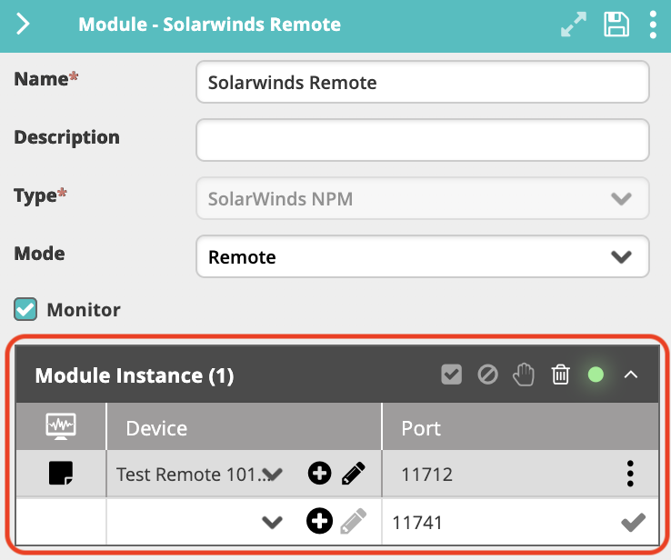
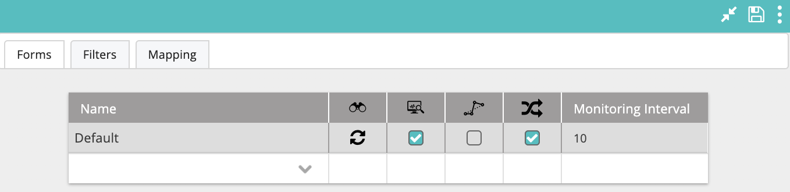
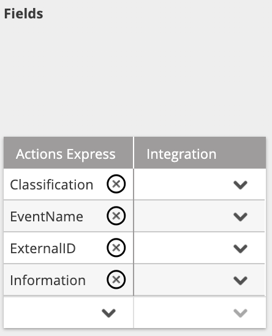
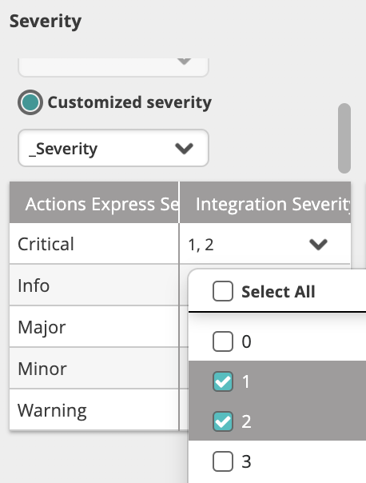
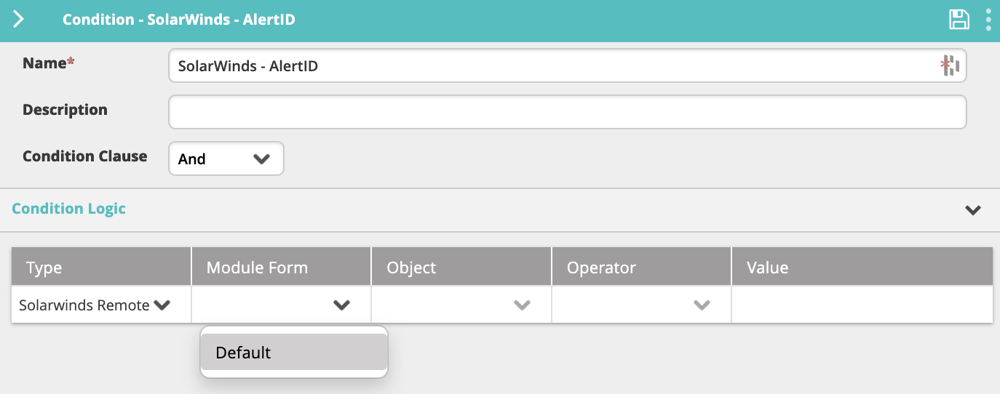
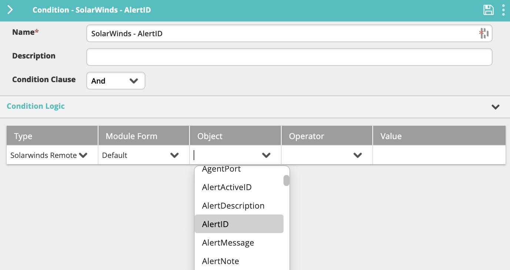
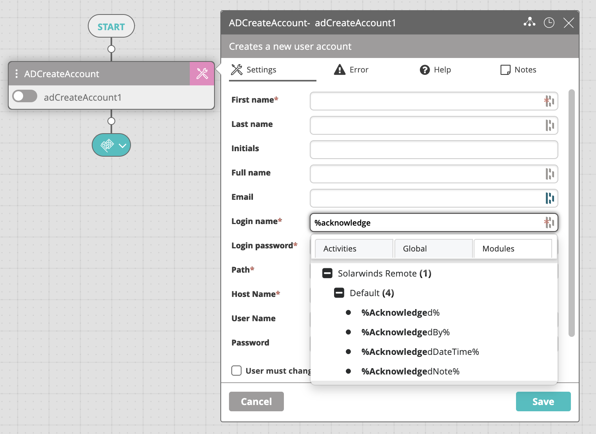

The SolarWinds NPM Module provides a bidirectional communication channel between SolarWinds NPM and VAR::PRODUCT_FULL. The connection between VAR::PRODUCT and SolarWinds is performed directly through the SolarWinds backend MS SQL Server database. After you add and configure the module, VAR::PRODUCT pulls new alerts and alert updates, translates them into incidents, and displays them as incidents. Alerts recovered in the SolarWinds NPM console trigger incident closure in VAR::PRODUCT.

## Prerequisites

The following provisions must be made before configuring the module.

### User Access

The user of the integration module must have **db_owner** permissions on the SolarWinds MS SQL Server database.

### Server Clock Synchronization

The clock on the SolarWinds NPM server machine must be in sync with the clock on the machine where the module is running. Depending on the module mode (**Cloud** or **Remote**), this could be the main VAR::PRODUCT machine or another machine.

## Creating the Module Instance

You need to configure a module instance for each SolarWinds NPM server that you want to integrate with.

1. Go to **Main Menu > Configuration > Integrations and Modules**.
2. From the top right corner of **Integrations**, click **+**.  
   The module properties screen appears.
3. In the **Name** field, enter a name for the new module instance.  
   It is a good practice to provide a descriptive name to let you distinguish between multiple module instances of the same type.
4. (optional) In the **Description** field, enter a description for the module instance.
5. From the **Type** field, select **SolarWinds NPM**.
6. In **Mode**, select where you want the module instance to run:
    * **Cloud**—The module instance will run in your cloud instance of VAR::PRODUCT. This option is suitable for integration with services that run in the cloud or on-premises services that are accessible from the cloud.
    * **Remote**—The module instance will run on the server where you installed the remote executor (installing a remote executor is needed when the server does not have access to the SQL DB). This option is suitable for integration with services that run in a separate network and are normally not accessible from the main network where VAR::PRODUCT runs.
7. Check **Monitor** if you want VAR::PRODUCT to monitor the integration instance.  
   By selecting this option, a new incident is created when the instance is down.
8. (**Mode: Remote** only) When you have one or more SolarWinds NPM integration installed on remote machines, you can select to which remote SolarWinds NPM integration you want to connect. Select the device where the integration instance is installed from **Module Instance > Device**, as well as the **Port** through which it will communicate.
   
    * If you haven't predefined a [Device](../../../Repository/Incident-Configuration/Devices.mdx#adding-devices) within **Incident Configuration**, you can click the plus icon to add a new Device directly from this screen. Enter a **Name** and an **IP Address** within the configuration, where the **Name** must be resolvable within DNS (FQDN) or IP Address.
9. Click **Save** to create the integration.
10. In the **Connection Parameters** section, specify the SolarWinds NPM server connection details:
    1. In the **Device** field, select the device where the SolarWinds MS SQL database is installed from the drop-down.
        * If you haven't predefined a [Device](../../../Repository/Incident-Configuration/Devices.mdx#adding-devices) within **Incident Configuration**, you can click the plus icon to add a new Device directly from this screen. Enter a **Name** and an **IP Address** within the configuration, where the **Name** must be resolvable within DNS (FQDN) or IP Address).
    2. In the **Port** field, enter the port through which the SolarWinds MS SQL database is accessed. The default is `1433`.
    3. In the **User name** and **Password** fields, enter the **db_owner** credentials.
       :::note
       You can assign lower DB permissions depending on the rights that you want to specify for the user account (for example, reading, creating, or updating alerts).
       :::
    4. Click **Test Connection** to verify your connection with the server.  
       A valid connection is indicated with a green tick icon.
11. Click **Save** again to complete this section of the configuration.
12. In the **Configuration Options** section, specify additional generic integration instance options:
    * **Log Level**—Select how verbose you want the integration-related log messages to be. Level 1 is the least verbose.
      The log file is located in the integration installation folder (`C:\Program Files\Resolve\Actions Express SolarWinds NPM` by default).
13. Click **Save**.

## Selecting SolarWinds NPM Alerts

Once the SolarWinds NPM integration has been fully configured, you can enable it to monitor for alerts, as well as define their filters and mapping options.

Click the expand icon () in the integration configuration screen.

The **Forms**, **Filters**, and **Mapping** tabs appear, displaying the available SolarWinds NPM forms and properties. Each form corresponds to a SolarWinds NPM alert.

1. In the **Forms** tab, a single row displaying the name Default is listed. To discover all fields associated with SolarWinds NPM alerts, click the discover icon that appears next to its name after selecting it ().  
   Once discovery is complete, the icon will change to circular arrows to indicate this.
   
2. Check the box in the **Monitoring** column () if you want VAR::PRODUCT to monitor data in this project and create events for detected SolarWinds NPM updates.
3. Checking **Bypass Incident** () will process VAR::PRODUCT events (records and updates) without creating incidents. Depending on your specific needs, this can be useful when the incoming information is not critical, and you simply want to use it in workflows.
4. Check **Execute Workflow on Every Update** () to run the corresponding workflow upon each update of the incident, or clear to run it only upon the first instance.
5. In a high-volume environment, we recommend setting the **Monitoring Interval** value between 30 and 60, meaning that VAR::PRODUCT will check for SolarWinds NPM updates every 30 to 60 seconds. By default, it is set to 10.
6. Once you have configured the project form, click **Save** to update the integration settings.

## Applying Filters

Filters determine which alerts will be discovered by VAR::PRODUCT. To get all requests for a specific alert, do **not** create any filters.

1. While still in the **Forms** tab, click on the default to select it.
2. Click the **Filters** tab.
3. In the **Name** column, enter the name of the filter you want to create and hit **Enter** or click the check mark. This name should be indicative of the criteria defining the filter.
4. In the **Filter Columns** table:
    1. In the **Name** column, select one of the discovered SolarWinds NPM alert fields on which to base the filtering.
    2. In **Relation**, select the type of relationship you want in the filter. The possible values here will vary based on the selected relation type.
       :::note
       Numeric value fields such as `_Severity` can only have an `Equals/Not equals` relation. `Contains/Not contains` is not supported.
       :::
    3. In **Value**, choose the values you want to capture.

## Mapping SolarWinds NPM Properties

In the **Mapping** tab, you can translate SolarWinds NPM properties into VAR::PRODUCT incidents. The window is divided into three sections: **Fields**, **Severity**, and **State**.

### Fields

In this section, you can translate SolarWinds NPM properties into VAR::PRODUCT variables. The SolarWinds NPM properties list (the drop-down in each row of the **Integration** column) is updated automatically based on the [discovery completed in the **Forms** tab](#selecting-solarwinds-npm-alerts).

To remove a field, click the **X** icon next to its name. To add a new field, click the down arrow in the empty row.

### Severity

In this section, you can translate SolarWinds NPM alert severity into VAR::PRODUCT severity. There are two options for severity selection:

* **Static Severity**—All alerts open an VAR::PRODUCT incident with the selected static severity.
* **Customized Severity**—Enables you to map the values of a specified field of the SolarWinds NPM alert against the VAR::PRODUCT severity.

An VAR::PRODUCT severity can be mapped into several SolarWinds NPM severity values. For example, if you want all SolarWinds NPM severity values of 1 and 2 to be opened as Critical incidents in VAR::PRODUCT, check the 1 and 2 options in the **Integration Severity** field:

You can also type values manually instead of selecting them from the drop-down menu. The manually entered values must exist in the drop-down list and are case-sensitive.

### State

In this section, you can translate SolarWinds NPM states into VAR::PRODUCT states.

Currently, you can only assign a **Static State** with SolarWinds NPM alerts. This means that all alerts open an VAR::PRODUCT incident with the selected static state.

:::note
When using a static state, closing/clearing an alert in SolarWinds NPM does not close the VAR::PRODUCT incident, and vice versa.
:::

:::note
When more than one mapping option is selected for the Up state, closing the incident in the VAR::PRODUCT LIVE Dashboard changes the selected property to the first option in the list.
:::

## Using SolarWinds Variables

In the SolarWinds integration, related variables are discovered in VAR::PRODUCT and can be used to define conditions or to configure an activity.

The "State" and "Severity" variables in SolarWinds correspond to "_State" and "_Severity" in VAR::PRODUCT.

### In a Condition

To use SolarWinds variables in a condition:

1. In the Main Menu > **Repository > General > Conditions** list, click the condition name and open its configuration panel on the right.
2. In the **Type** column, select the name of the SolarWinds integration from the list.
3. In the **Integration and Module Form** column, select the relevant form name to discover its fields. You can add as many form entries as needed.  
   
   All imported SolarWinds variables will appear in the **Object** list.  
   
4. If you add the form to the condition and the **Condition Clause** field is set to "And", only fields from the specified form will match the condition.

### In an Activity

To use SolarWinds variables in an activity:

1. In the Main Menu > **Builder > Workflow Designer**, open the activity settings.
2. In the desired field, type `%`. This will open the variable menu.
3. You can either continue to type the variable name if you know it, or click on the **Integrations and Modules** tab, find the SolarWinds integration and select the variable you want to use.
   

## Troubleshooting

Use this information to resolve common issues that may occur with this integration module.

### Error: "Failed Test Connection"

This error can appear when testing the connection during integration configuration.

#### Probable Cause

* No connectivity to the database server;
* The device that was selected in the **Connection Parameters** section either doesn't have the SolarWinds NPM database installed or SolarWinds NPM services aren't running on it.

#### Possible Resolution

In the first case, check if the connection parameters were entered correctly.

In the second, make sure that the device selected in the **Connection Parameters** has the SolarWinds NPM database installed or that SolarWinds NPM services are running on it.

### Error: “Cannot open database “SolarWindsOrion”

This error can appear when a login attempt fails.

#### Probable Cause

The error indicates lack of connectivity with the database server.

#### Possible Resolution

To resolve the issue, verify the following:

* The port specified in the integration **Connection Parameters** is the configured TCP/IP port to connect to the SolarWinds NPM database (make sure that the port is open).
* The **Connection Parameters** contain the correct user name and password to connect to the SolarWinds NPM integration.

## Related Activities

To use the VAR::PRODUCT SolarWinds NPM activities, open the **Workflow Designer** in the Main Menu **Builder** section. Search, browse, or click the **+** in the canvas area to find the desired activity and add it to the workflow.

The following SolarWinds NPM activities are available:
* [Acknowledge Alert Activity](../../../../Activity-Repository/SolarWinds-NPM/solarwinds-npm-get-alert.mdx)
* [Add Note Activity](../../../../Activity-Repository/SolarWinds-NPM/solarwinds-npm-add-note.mdx)
* [NPM Get Alert Actitivy](../../../../Activity-Repository/SolarWinds-NPM/solarwinds-npm-get-alert.mdx)
* [NPM Get Node Activity](../../../../Activity-Repository/SolarWinds-NPM/solarwinds-npm-get-node.mdx)
* [NPM Manage Node Activity](../../../../Activity-Repository/SolarWinds-NPM/solarwinds-npm-manage-node.mdx)
* [NPM Unmanage Node Activity](../../../../Activity-Repository/SolarWinds-NPM/solarwinds-npm-unmanage-node.mdx)
* [Unacknowledge Alert Activity](../../../../Activity-Repository/SolarWinds-NPM/solarwinds-unacknowledge-alert.mdx)

