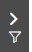

The **Filter** panel allows you to easily locate integrations or modules.

To filter the list of integrations or modules:

1. From the left side of the screen, click the Filter button:  
     
   The filter pane will appear:
2. In the top edit box, enter your filter text.
3. Select the status from the list.
4. Click **Apply** to filter the list.