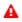

The lists (both Core Components and Integrations) provide the following information:

| Column | Description                                                                         |
| --- |-------------------------------------------------------------------------------------|
|  | Status Indicator |
| Name |  User defined name of Integration                                                                         |
| Mode | Location of integration: Cloud or Remote                                                                     |
| Type | Summary of component or integration                                                                    |
| Description |  User defined description of integration                                                                  |
 
## Status Indicators

The available status icons and their meanings is shown in the following table:

| Status symbol | Meaning | Additional Indication| 
| --- | --- | --- |
|  | Up and running correctly | |
|  | Down, nothing goes through it even though it is connected. | |
|  | Technical error: Any communications error other than credentials. | |
|  | Connection error due to credentials problem | |
|  | In the process of shutting down | Blinks while shutting down |
|  | Ready to shut down. It  has stopped handling activities. | |
|  | Powered off. Final status. | |
|  | Disabled | |
|  | Waiting for initialization, before power up | Blinks during the wait |
|  | Initializing - in the process of starting up. | |