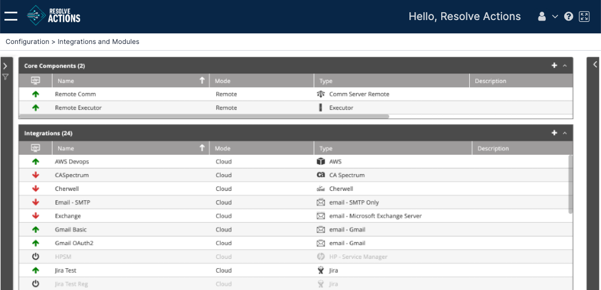

## Understanding Integrations and Modules

VAR::PRODUCT_FULL Integrations and Modules are used for communication, remote execution, and systems integration with external services. Each integration serves as an interface to its equivalent service - a mail service, telecommunication, or command executor. Each integration is configured individually according to its parameters. Multiple instances of the same integration can be defined by using the integration instance table in the integration configuration window, allowing for high availability and redundancy.

Each Integration is subject to the [license](../../Configuration/viewing-the-license-details.mdx) agreement.

When switching between the integrations, the related service must be restarted. The following table describes a sample of integration types:

import Admonition from '@theme/Admonition';

| Integration                 | Description                                                                                                                                                                                                                                                                                                                                                                                                                 |
|------------------------|-----------------------------------------------------------------------------------------------------------------------------------------------------------------------------------------------------------------------------------------------------------------------------------------------------------------------------------------------------------------------------------------------------------------------------|
| Caller          | Dial-up servers for incoming and outgoing phone calls. Caller  are responsible for performing all IVR and telephone related workflow activities.                                                                                                                                                                                                                                                                     |
| Email           | Email components that perform email related workflow activities such as sending and receiving emails. Similar to MS Outlook or MS Outlook Express accounts.                                                                                                                                                                                                                                                                 |
| Everbridge             | Integrates VAR::PRODUCT with Everbridge.                                                                                                                                                                                                                                                                                                                                                                                    |
| MS Operations Manager  | Integrates VAR::PRODUCT with MS Operations Manager.                                                                                                                                                                                                                                                                                                                                                                         |
| HP Service Manager     | Integrates VAR::PRODUCT with HP Service Manager.                                                                                                                                                                                                                                                                                                                                                                            |
| IBM Tivoli Omnibus     | Integrates VAR::PRODUCT with IBM Tivoli OMNIbus.                                                                                                                                                                                                                                                                                                                                                                            |
| Text Message           | Cellular components that send text messages to VAR::PRODUCT [recipients](../../../Product-Navigation/Repository/Recipients/Managing-Users.mdx).                                                                                                                                                                                                                                                                                                                               |
| Executor               | Runs any type of command, batch file, or .exe file on a local or remote machine.<Admonition type="note">
The executor module may be installed locally or separately on each machine from which commands are executed.
</Admonition> <Admonition type="note">
The communication between the VAR::PRODUCT Server and the executor module is unidirectional and is encrypted by 3DES using port 11006.
</Admonition> |
| SYSLOG                 | A connector to SYSLOG Daemon.                                                                                                                                                                                                                                                                                                                                                                                               |
| Message Queue          | Connectors to a Microsoft/IBM MQ components (used to manage queues of messages and requests).                                                                                                                                                                                                                                                                                                                               |
| ServiceNow             | Integrates VAR::PRODUCT with ServiceNow.                                                                                                                                                                                                                                                                                                                                                                                    |
| SNMP                   | Receives SNMP traps sent from external devices to VAR::PRODUCT.                                                                                                                                                                                                                                                                                                                                                             |
| Event Gateway          | Provides a RESTful API to receive events from external sources.                                                                                                                                                                                                                                                                                                                                                             | 

Choose **Configuration > Integrations and Modules** and open the **Core Components** or **Integrations** lists. A window similar to the following is displayed:

:::note
Creating new core components is not supported in VAR::PRODUCT. Although it is technically possible to create a new one from the **+** icon in the top right of the **Core Components** table, it would not be working.
:::

:::note 

A Remote Executor is a required component for many activities used in an Actions deployment. 

The Remote Executor can be any Windows server that meets the prerequisites outlined in the [Prerequisites](../../../Getting-Started/Setting-Up-Hybrid-Components/Prerequisites.mdx) section. 

Activities that do not require a Remote Executor will not include the option to select on in the **Advanced** settings dropdown in the [Activity Settings](../../../Product-Navigation/Workflow-Designer/Parameters/select-executor-module.mdx).

:::