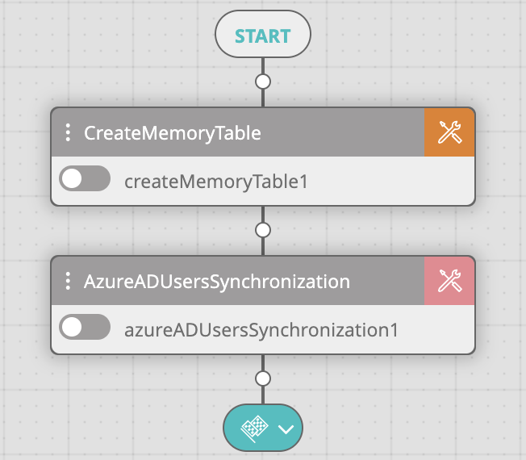
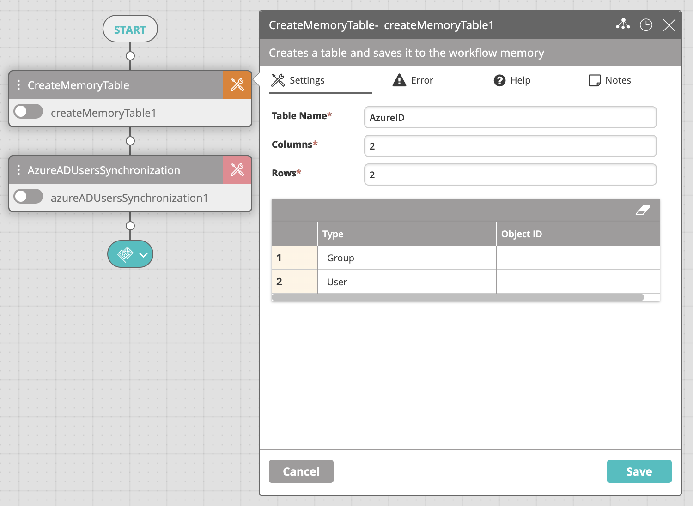

Configuring VAR::PRODUCT_FULL to allow SSO from a SAML IdP is a multi-step process:

* Synchronize with Azure AD
* Convert Recipients to Users
* Enable SSO
    
## Synchronizing with Azure AD

Before you enable SSO, you need to synchronize VAR::PRODUCT with your Azure AD. This step creates a recipient for every AD user of group that you choose to synchronize. After synchronizing with AD, the following recipients will appear under **Main Menu > Repository > Recipients**:

* In the Users table, a recipient for every individual AD user or AD group member that you synchronize.
* In the Groups table, a recipient for each parent AD group that you synchronize and each child AD group within those parent groups.

After you create the recipients, you will turn them into Users in the next step of the configuration process.

:::note
While all account types can be synced to VAR::PRODUCT, the following types cannot log in:

*   External Azure Active Directory
*   Windows Server AD
*   Microsoft Account

For groups, only security groups synced from AD can be used to create Login Groups in VAR::PRODUCT. Distribution groups are not supported in this manner.
:::

Take these steps to synchronize VAR::PRODUCT with Azure AD:

1. In the **Workflow Designer**, create a new workflow with the following activities:
   1. [Create Memory Table](../../../Activity-Repository/Tables/Table/create-memory-table.mdx)
   2. [Azure AD Users Synchronization Activity](../../../Activity-Repository/Azure/azure-ad-users-synchronization.mdx)
      
2. Edit the table in the Create Memory Table activity while maintaining the following guidelines:
   * The table must contain only two columns: **Type**, **Object ID**.
   * Add a row for each group that you want to sync, setting **Type** to Group and **Object ID** to the ID of the specified object.
   * Add a row for each user that you want to sync, setting **Type** to User and **Object ID** to the ID of the specified object.
   * You may add as many rows to the table as you want.
     
3. Edit the Azure AD Users Synchronization activity settings:
   * **Tenant ID**: Tenant ID in Azure AD.
   * **App Client ID**: The Application (client) ID associated with the Azure App Registration.
   * **Client Secret**: Secret string generated within the Azure App Registration for requesting a token.
   * **AD Users**: The list of AD users/groups to synchronize. This can be static (the object ID for a single user and/or group) or a reference to a memory table created for this purpose.  
     If we use the above example, the value of this field will be the **Table Name** field of the Create Memory Table activity: `%AzureID%`.
   * **Update Existing**: By default, if a user or a group already exists (has been created manually before synchronization), they will not be updated. When this is checked, existing users are updated.
   * **Recursive Groups**: When a group is synchronized, you may decide whether to synchronize the data recursively or not. When synchronizing the data recursively, subgroups and user data are also synchronized.  
     In VAR::PRODUCT, subgroups appear at the same level as their parent groups.
4. Run the workflow.

Take these actions to ensure that the synchronization was successful:

* Check the **Workflow Execution Log** to find out how many users were synchronized.
* Go to **Main Menu > Repository > Recipients** and check for recipients matching your AD entities, under **Users** and **Groups** respectively:
   * The **Origin** column for such users shows AD.
   * The **Domain** column for such users shows your AD domain name.

### Keeping Directories in Sync

As AD records change in time, you will want to keep them in sync with the VAR::PRODUCT database. You have several options to do that:

* Manually running the Azure AD Sync workflow
* Scheduling the Azure AD Sync workflow
* Including extra user attributes in the SAML response

#### Synchronizing Manually

Every next run of the workflow you created for synchronizing VAR::PRODUCT with your Azure AD updates the local records – deletes records that are no longer available, adds new records that have appeared in AD, and updates records that have changed.

You can manually run the workflow whenever you want to perform a synchronization. It is important to double-check if the **Update Existing** option is selected.

#### Synchronizing on Schedule

If you want to synchronize VAR::PRODUCT with Azure AD on a regular basis, you can schedule the workflow that you created for that purpose.

Take these steps to schedule the synchronization workflow:

1. Log in to VAR::PRODUCT using an admin account.
2. Go to **Main Menu > Workflow Designer**, open the Azure AD synchronization workflow that you created, and double-check if the **Update Existing** option is selected.
3. Go to **Main Menu > Repository > Schedules and Triggers** and create a schedule under **Schedules**.  
   See [Schedules](../../../Product-Navigation/Repository/Schedules-and-Triggers/Schedules.mdx) for details.
    
#### Including Optional Attributes

Another option is to manage SSO logins through group membership. After the initial synchronization of one or more groups, you can allow all current members of these groups to log in, even if they haven't been synchronized recently. You do that by configuring the SAML response to include a few optional attributes in the SSO settings of your IdP. This approach is useful when you don't want to run periodic synchronizations or you want new AD users to be allowed on VAR::PRODUCT as soon as their account is created.

The attributes that the SAML response needs to include are:

* `first_name`
* `last_name`
* `activeDirectoryId`

VAR::PRODUCT asks for these optional attributes when making a SAML claim. If you don't configure the response to include them, new group members will only be able to SSO after a re-synchronization.

## Enabling Recipients to Log In

Synchronizing VAR::PRODUCT with Azure AD only creates recipients in VAR::PRODUCT. To allow the recipients to log in to VAR::PRODUCT, you need to convert them to VAR::PRODUCT users or groups.

Take these steps to convert recipients to User Management:

1. Log in to VAR::PRODUCT using an admin account.
2. Go to **Main Menu > Configuration > User Management**.
3. To add a user:
   1. In the **Users** area, click the plus sign.
   2. In the side panel that appears, start typing the name of the recipient that you want to add as a user and select it from the suggestions list.  
      Recipients originating from AD have the AD domain name included in parentheses after the name. The available user details are automatically populated.
   3. In **Role**, select an VAR::PRODUCT role for the user.
   4. Optionally, fill in the empty user details.
   5. Click **Save**.
4. To add a group:
   1. In the **Groups** area, click the plus sign.
   2. In the side panel that appears, start typing the recipient group that you want to allow login for, and select it from the suggestions list.  
      Groups originating from AD have the AD domain name included in parentheses after the name.  
      The available group details are automatically populated.
   3. In **Role**, select an VAR::PRODUCT role for the group.  
      Child groups do not receive the role.
   4. Click **Save**.

### Conflicting Roles

 If a user is included as part of a login group and also named individually in the **Users** table, the higher of the two permissions will be the one the user has upon login.
For example:

* John Doe is listed in the Users table with the role **Administrator**.
* John Doe is part of the Help Desk group listed in the Groups table with the role **Workflow Editor**.
* Upon login, John Doe will always be granted administrator privileges.
There is a known issue with deleting accounts - the user deleting the account is not always recognized as having the appropriate permissions. The user's individual role is the only one being checked, and not any group role that they are in. In such a case, if their individual role isn’t sufficient, they will not be able to delete some accounts.
For example:
* John Doe is listed in the Users table with role **Operator**.
* John Doe is part of the Administrators group with role **Administrator**.
* John Doe tries to delete another administrator account, which he should be able to do since he's part of the Administrators group.
* The delete fails because John Doe's individual **Operator** role is the only one taken into account, and is not sufficient for deleting an administrative account.

## Enabling SSO

Configuring the IdP's details into VAR::PRODUCT serves a double purpose in enabling SSO. Take these steps to enable SAML SSO in your VAR::PRODUCT instance:

1. Log in to VAR::PRODUCT using an admin account.
2. From the main menu, select **Configuration > User Management**.  
   The User Management screen appears, containing multiple accordion items.
3. On the SSO accordion item, click the plus icon.
   The SSO panel appears on the right.
4. Fill in the following details:
   * **SAML Metadata URL**—Enter the SAML URL provided by your IdP.
   * **App Unique ID**—Enter the SAML Entity ID generated by your IdP. Depending on the IdP, the Entity ID could be called App ID or something similar.
   * **Enabled**—Select the checkbox to activate SSO.
5. Click **Save**.

A new entry for your IdP will appear on the SSO accordion item.

## Editing the SSO Configuration

When you are editing the details of an existing IdP in VAR::PRODUCT, the changes come into effect immediately after saving them. Depending on what you change, you may need to resynchronize VAR::PRODUCT with Azure AD.

Take these steps to change the details of the existing configuration:

1. Log in to VAR::PRODUCT using an admin account.
2. From the main menu, select **Configuration > User Management**.  
   The **User Management** screen appears, containing multiple accordion items.
3. On the **SSO** accordion item, click the entry that you want to edit.  
   The **SSO** panel appears on the right.
4. Change the details and click **Save**.

## Deleting the SSO Configuration

To prevent users from using SAML SSO to log in to VAR::PRODUCT, or to configure a different IdP, delete the existing SSO configuration.

Take these steps to delete the existing IdP entry:

1. Log in to VAR::PRODUCT using an admin account.
2. From the main menu, select **Configuration > User Management**.
   The **User Management** screen appears, containing multiple accordion items.
3. On the **SSO** accordion item, click the entry that you want to delete.
4. In the **SSO** accordion item's title bar, click the trash icon and then confirm the deletion.