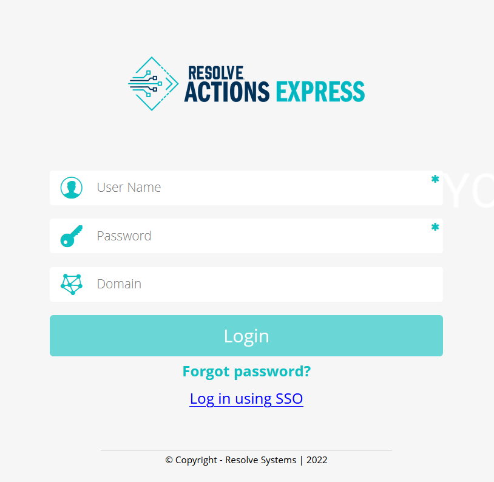

After you configure SSO, users will be able to log in with their SSO credentials from the VAR::PRODUCT_FULL login screen.

Take the following steps to log in as an SSO user:

1. On the VAR::PRODUCT login screen, click the **Log in using SSO** link.  
   You are redirected to the IdP's website.
2. Enter your SSO username and password.
3. Optionally, check the option to remember your credentials for future use.  
   If you choose to remember your credentials, you will be logged in automatically the next time you click the **Log in using SSO** link.  
   

You can still log in as an VAR::PRODUCT-managed user by entering your local username and password and then clicking the **Login** button.