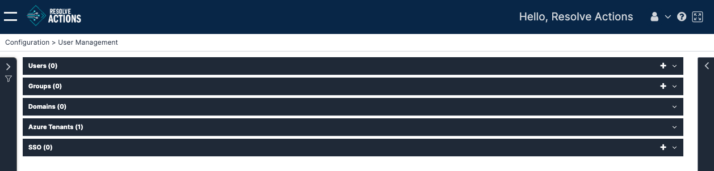
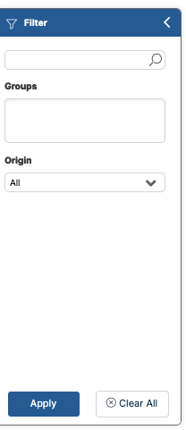

The **User Management** screen allows you to manage users who log in to VAR::PRODUCT_FULL and apply different permissions to each of them.

:::note
Recipients of VAR::PRODUCT are created in **Repository > [Recipients](../../Repository/Recipients/Managing-Users.mdx)**. They can afterwards be turned into [Login Users](./managing-login-users.mdx) and [Groups](./managing-login-groups.mdx).

Recipients can also be synced into VAR::PRODUCT from Azure Active Directory (AD) via the [Azure Ad User Synchronization](../../../Activity-Repository/Azure/azure-ad-users-synchronization.mdx) procedure.
:::

Choose **Configuration > User Management**. The following window with the available login categories is displayed:

[TODO: update this SS once the Domains tab has been removed from the UI]: #

## Filtering User Management

The Filter panel left of the Users list lets you quickly locate login users and groups.

To use it, click the expand arrow above the filter icon on the left. 

To find users:
* **Search:** Search by name in the top bar.
* **Groups:** Click in the field to find all groups. 
* **Origin:** Dropdown to select the origin of users.

