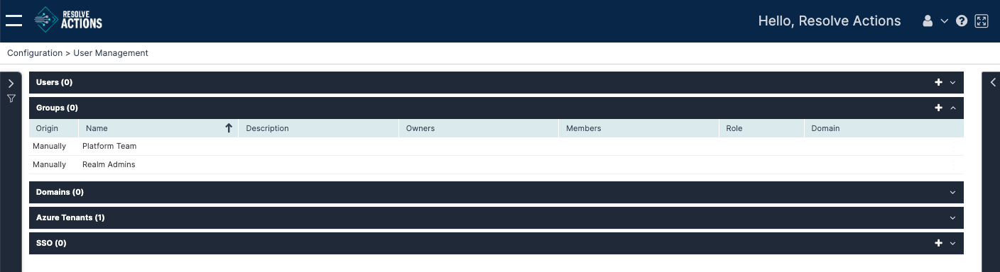

Choose **Configuration > User Management** and open the **Groups** list. The following window is displayed:

The **Groups** list provides the following information:

| Column        | Description                                                                   |
|---------------|-------------------------------------------------------------------------------|
| Origin        | Imported manually or from Active Directory                                    |
| Name          | Name of the group                                                             |
| Description   | Group description                                                             |
| Owners        | A group may have several owners shown in a comma-separated list               |
| Members       | Group members                                                                 |
| Role          | [Role](./managing-login-users.mdx) assigned to the group (meaning to all of its users |
| Domain        | Active Directory domain (if applicable)                                       |

:::note
The only possible actions on Groups here are delete and add. Click on a group to visualize them in the upper-right corner of the list.
:::

## Creating Login Groups

1. From the upper-right corner of the Groups table, click the plus icon.  
   The group properties screen appears.
2. Enter the group name. 
3. (Optional) Enter the group's description.
4. In **Role**, select the user role for all members of the group.
5. (Optional) Enter the group's Active Directory domain, if applicable.
6. In **Group Owners**:
   * Under **Owner Name**, select the name of the respective user.
   * To remove a user from the owners list, click the X icon next to their name.
7. In **Group Members**:
   * Under **Type**, select whether you want to add a user or an entire group as a member.
   * Under **Name**, select the name of the respective user or group.
   * To remove a user or a group from the members list, click the X icon next to their name.
8. Click **Save**. 
