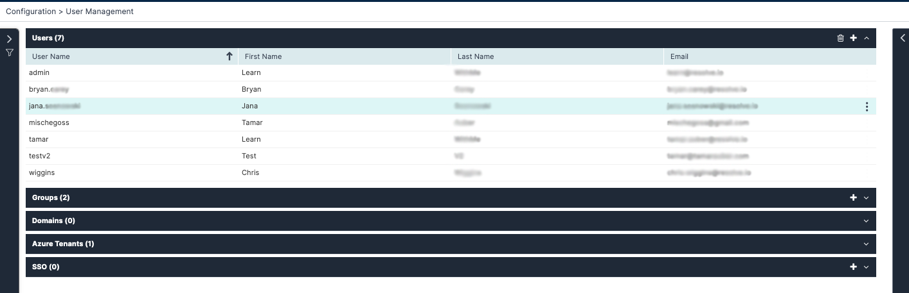

Choose **Configuration > User Management** and open the **Users** list. The following window is displayed:

The **Users** list provides the following information:

| Column           | Description                                |
|------------------|--------------------------------------------|
| User Name        | User display name                          |
| First Name       | User first name                            |
| Last Name        | User last name                             |
| Email            | User email (not validated here)            |

:::note
The only possible actions on Users here are delete and add. Click on a user to visualize them in the upper-right corner of the list.
:::

## Creating Login Users

1. From the upper-right corner of the Users table, click the plus icon.  
   The user properties screen appears.
2. Enter a User Name, First and Last name, and email address.
3. In **Role**, select the user role.
4. Under **Group Membership**, add the user to one or more [groups](../../../Product-Navigation/Repository/Recipients/Managing-Groups.mdx).
   1. Under **Name**, select the group to which the user will be added.
   2. To remove the user from the group, select the group from the group membership list and click the X icon.
5. Click **Save**.

### Passwords

After clicking **Save**, the user will receive an email with instructions to set a password.