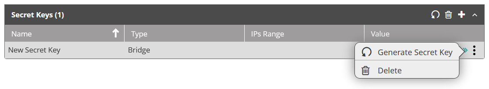

If you have generated secret keys for use with the VAR::PRODUCT_FULL Hybrid Installer or webhooks, you might need to regenerate them. Regenerating is required if you failed to take note of the secret key or if you suspect it might have been compromised. Regenerating a key means disposing of the existing key and replacing it with a fresh key.

Take these steps to regenerate an existing secret key:

1. From the top navigation bar, open the hamburger menu and click **Configuration > API Access**.
2. In the **Secret Keys** section, click the secret key that you want to regenerate.
3. At the row's right end, click the three-dot menu and select **Generate Secret Key**.  
   
4. Read the warning and click **OK** to continue.
5. From the **Generate Secret Key** dialog box that appears, take note of the **Value** field.  
:::caution
The value is only presented once. If you fail to copy the value, you will have to regenerate the key.
:::    

When regenerating the Bridge key, you need to also update it on your on-premises VM where you set up the Actions Hybrid Installer. Take the following steps to update the Bridge key on-premises:

1. On the VM where you set up the Actions Hybrid Installer, go to `C:\Program Files\Resolve\Actions Express Comm Server Remote`.
   Replace `C:\Program Files` with the actual path if you’ve installed Actions in a non-default folder.
2. Run the **BridgeKeySet** application.
3. In the Actions Bridge Key Set application that opens, enter the following details:
   * **Tenant ID**—Do not change. It will be prepopulated with the correct Tenant ID.
   * **Bridge Client ID**—Do not change. It will be prepopulated with the correct Bridge Client ID.
   * **Bridge Client Secret**—Paste the new Bridge key that you generated.
   * **Proxy URL**—(Optional) If you want to use a proxy server to connect to your Actions cloud tenant, enter its URL here.
   * **Username**—(Optional) If the proxy server requires authentication, enter the username here.
   * **Password**—(Optional) If the proxy server requires authentication, enter the password here.
4. Click **Submit**.