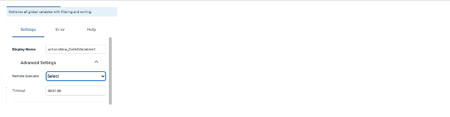

## Configure Modules

### Comm Server Remote

Open the hamburger menu in the top navigation bar and click **Configuration > Integrations and Modules**.

1. Use the plus (+) button to add a new _Core Component._ 
2. Name the module "Remote Comm".
3. Select **'Comm Server Remote'** under Type.
4. **Mode** should automatically switch to "Remote."

Under _Module Instance_, use the dropdown under **Device** to select the hostname of the machine where you installed the Remote Executor. Click the check mark to set the Device and **Save.**

### Executor

Open the hamburger menu in the top navigation bar and click **Configuration > Integrations and Modules**.

1. Use the plus (+) button to add a new _Core Component._ 
2. Name the Module now.
3. Select **'Executor'** under Type.
4. Set the **Mode** to "Remote."

If the service is running, the VAR::PRODUCT_FULL Remote Executor should be started on the host machine, and the Module's status should appear as **UP.**

## Using the Remote Executor

Build a new **Workflow**, and after adding an **Activity**, click the Activity to open the right-hand configuration panel.

Under the **Advanced Settings** module, find the Remote Executor settings. 

:::note
The Remote Executor settings will not appear under Advanced Settings if the activity does not require a remote executor.
:::