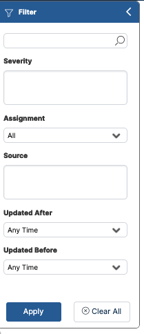

The Filter panel allows you to easily locate incidents and workflows.

To filter the list of incidents/workflows:

1. From the left side of the screen, click the filter (funnel) icon.  
   The filter pane appears:  
     
   :::note
   The available filtering criteria vary according to the selected tab - open incidents or running workflows. The latter only has the first search field.
   :::
2. In the top edit box, enter your filter text.  
    :::tip
    In the running workflows tab, the free text search field applies to workflow names. In the open incidents tab, the free text search field applies to device/service names, classification names, information, workflow names, assignee and external ID.
    :::  
    Complete the filtering procedure by filling out the rest of the fields.
3. Click **Apply** to filter the list of entities