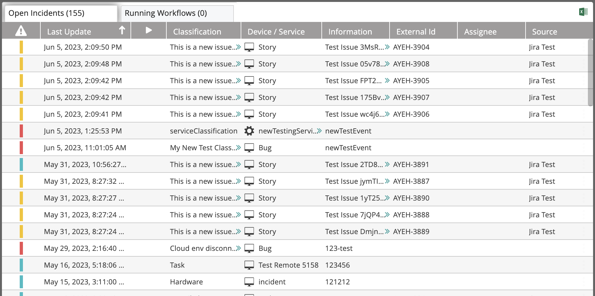
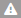
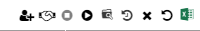
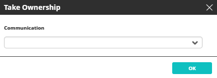
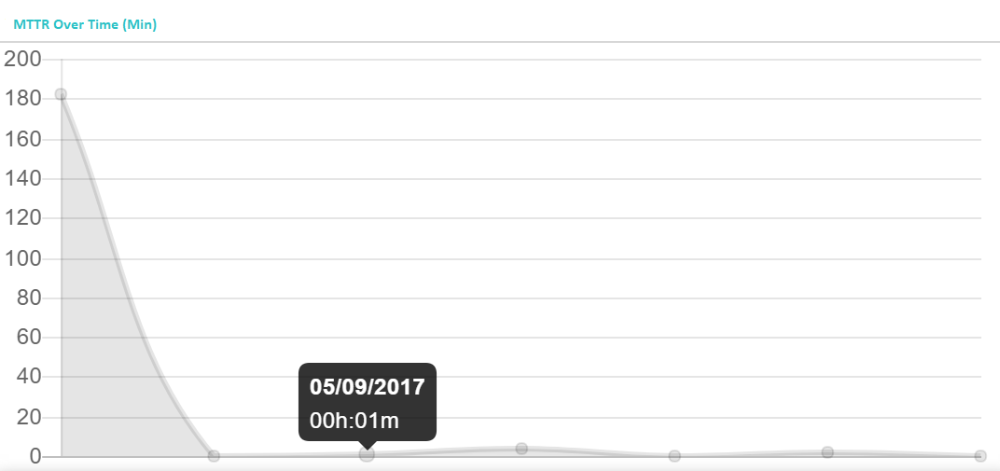
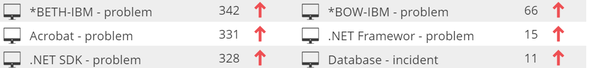
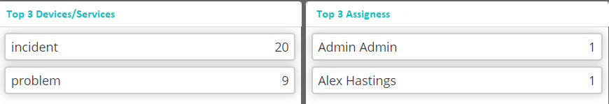

### Understanding the Open Incidents List

The following figure shows the **Open Incident** list.

The following table explains the list columns:

|Column|Description|
|---|---|
|  | Severity of the incident (red=critical, yellow=major, blue=minor)|
| Last Update| Last update date and time |
||An indication of a trigger (workflows which were triggered by an incoming event are indicated by this).|
|Classification|Incident classification|
|Device/Service|The incident originates from this device or service|
|Information|Incident description|
|External Id|For incidents that are parsed using the [Event Parsing](../../../Product-Navigation/Repository/Incident-Configuration/Event-Parsers.mdx) mechanism or created using the [New Incident Activity](../../../Activity-Repository/Incidents/Actions/new-incident.mdx) activity, the external ID is created automatically. For incidents that were created by mapping (using one of the built-in integrations), the external ID is the value mapped by VAR::PRODUCT into the module configuration. It is an internal procedure that assigns a unique ID to every incident.  Example: If the integration is a ticketing system, the external ID can be mapped to the ticket ID. By doing so, every time a new ticket is created, a new incident will also be created regardless of the Device/Service and Classification combination. |
| Assignee| The user assigned to handle the incident|
|Source|The source (for example: any of the integration modules)|
  
### Managing Open Incidents

To choose an open incident for management, click anywhere in its line in the list. Notice that a three-dot menu appears at its right end. Clicking it opens an actions list.

The same actions can be accessed from the icons on the top right of the **Open Incidents** list:

The icons operate on the selected open incident. Their use is described in the following table:

| Icon|Description|
|---|---|
||[Assign the incident to another user](#assigning-the-incident-to-another-user)|
||[Take ownership of the incident](#taking-ownership-of-the-incident)|
||Stop the assigned workflow|
||[Start the assigned workflow](#starting-the-assigned-workflow)|
||Open the incident in the Audit Trail|
||Open in the Incident History|
||Close the incident|
||Reset the incident|
||Export the incident to an Excel file|

#### Assigning the Incident to Another User

To assign an incident to another user:

1. Click the **Assign to** icon.  
   The **Assign to** dialog box opens.
2. Select the **User** to which the incident will be assigned.  
   Choose an existing user by selecting a user from the drop-down list. You can also search for a user by typing part of the user name. Having selected a user, you can edit the entry by clicking the pencil icon. Click the plus icon to add a new user.
3. Select the **Communication** method.  
   The choices are Email or SMS.
4. Select the **Template** of the message that will be sent to the user.  
   Choose an existing message template by selecting a template from the drop-down list. You can also search for a template by typing part of its title. Having selected a template, you can edit the entry by clicking the pencil icon. Click the plus icon to create a new message template. Message templates are created and managed in [Understanding Message Templates](../../../Product-Navigation/Repository/General/Message-Templates.mdx#understanding-message-templates).
5. Enter the number of minutes within which the assigned user must respond (**Timeout**) and click **OK**.

#### Taking Ownership of the Incident

Clicking this icon opens the **Take Ownership** dialog box:

*   Select the Communication method. The choices are Email or SMS.
    

#### Starting the Assigned Workflow

Clicking this icon opens the **Start Workflow** dialog box.

To start the assigned workflow:

1. Select the **Workflow** name.  
   :::note
   Once variables have been set (see [Setting Variables in Workflows](../../../Building-Your-Workflow/Variables/set-variables-in-workflows.mdx), selecting the workflow from the **Workflow** dropdown will display the **Set Values & Run** window. Users with editing permissions have the option to select which variables to be used during the workflow execution while users without editing permissions must insert values for all of the required variables to execute the workflow.
   :::
2. Select one of the available options:
   * **Move to Audit Trail**: After running the workflow, the Audit Trail window opens so that you can watch its progress.
   * **Stay in current**: After running the workflow, you remain in the current Workflows window. Use this option to concurrently run several workflows.

### Opening Incidents Gauges

The gauges and graphs display the relevant information according to the selected period. Use the **Time Frame** drop-down list to select it.

The top section shown above displays the **running workflows** (segmented by trigger/schedule), **incidents** (segmented by severity), **incidents** (segmented by source and by status):

The **MTTR Over time** graph displays the mean time to recover at different points in time, according to the selected time frame.

:::tip
Hovering over an individual point will display the specific date and time of the measurement.
:::

For example, in the following illustration the selected time frame is **Last 7 days** and the points on the horizontal axis represents days. 

Below the **MTTR Over Time** graph is a list of incidents in respect of which the MTTR was the highest (within the selected time frame). The arrow symbol next to each incident name indicates whether the MTTR increased or decreased (compared to the previous period). In the illustrated example, the MTTR of the displayed incidents was higher than the MTTR in the preceded period:

The bottom section displays the most common devices and services that were involved in the incidents, and the most common assignees (in the selected time frame):

