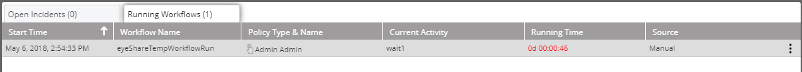
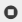
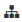
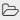
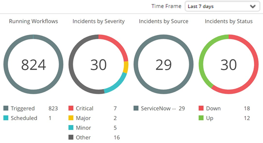
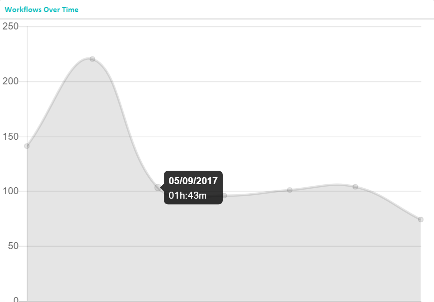
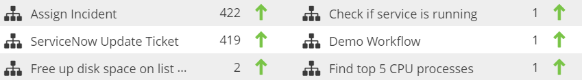
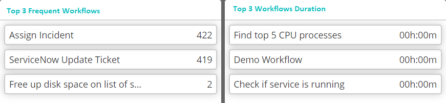

### Understanding the Running Workflows List

The **Running Workflows** tab shows what workflows are running at the moment you are viewing the list.

The following table explains the list columns.

|Column|Description|
|---|---|
| Start Time | The workflow's starting time |
| Workflow Name | The workflow's name |
| Schedules and Triggers| How the workflow is initiated - indicates whether the workflow was triggered by an event or scheduled execution|
| Current Activity| Workflow activity being currently performed|
| Running Time | Workflow running duration |
| Source | Indicates how the workflow was invoked  - manually or from another workflow activity |

### Managing the Running Workflows

To choose a running workflow for management, click anywhere in its line in the list. Notice that a three-dot menu appears at its right end. Clicking it opens an actions list.

The Running Workflows action icons are described in the following table.

| Menu item | Description |
|---|---|
| | Stop the workflow |
|  | Open the workflow in the Workflow Designer |
|  | Open in the Repository |
|  | Open in the Audit Trail |

### Running Workflows Gauges

The gauges and graphs display the relevant information according to the selected period. Use the **Time Frame** drop-down list to select it.

The **Workflows Over time** graph displays the duration of running workflows at different points in time, according to the selected time frame.

:::tip
Hovering over an individual point will display the specific date and time of the measurement.
:::

For example, in the following illustration the selected time frame is **Last 7 days**, and the points on the horizontal axis represents days. 

Below the **Workflows Over Time** graph is a list of the most frequently run workflows. The counts shown are the number of times the workflow has been run during the defined time period.  The arrow symbol next to the count indicates whether the number of times the workflow has been run during the current period increased or decreased compared to the preceding period. In the above example, the counts of all workflows were higher than in the preceding period:

The bottom section displays the most frequent workflows and the workflows of which the duration was the longest (in the selected time frame):

