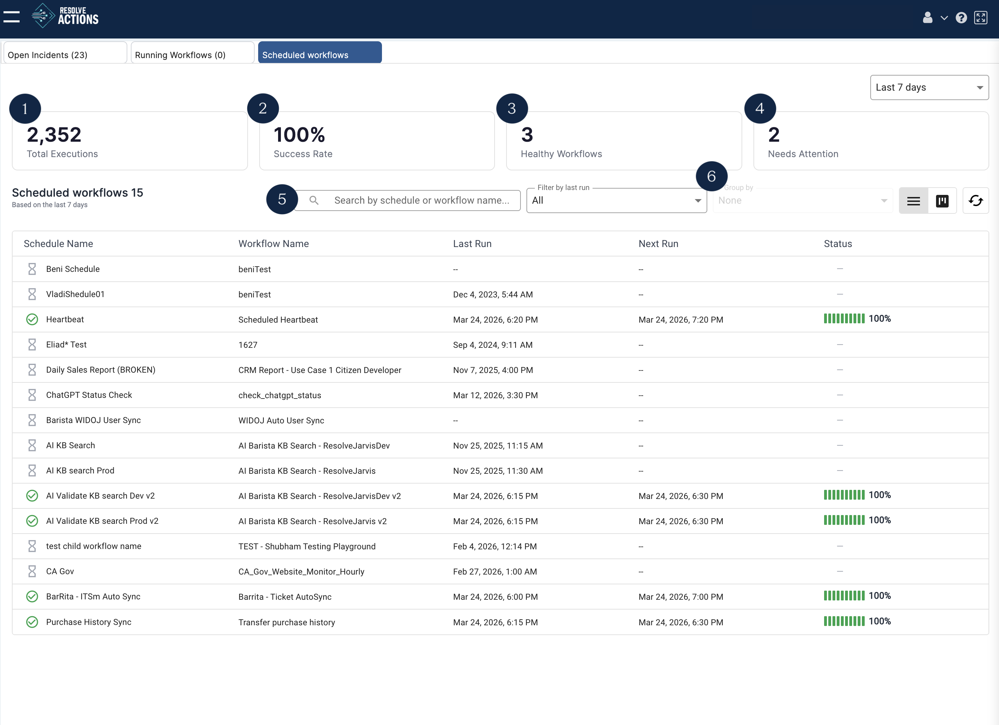
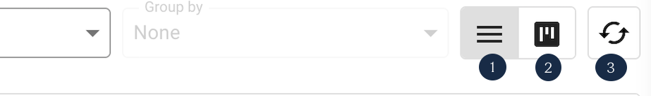
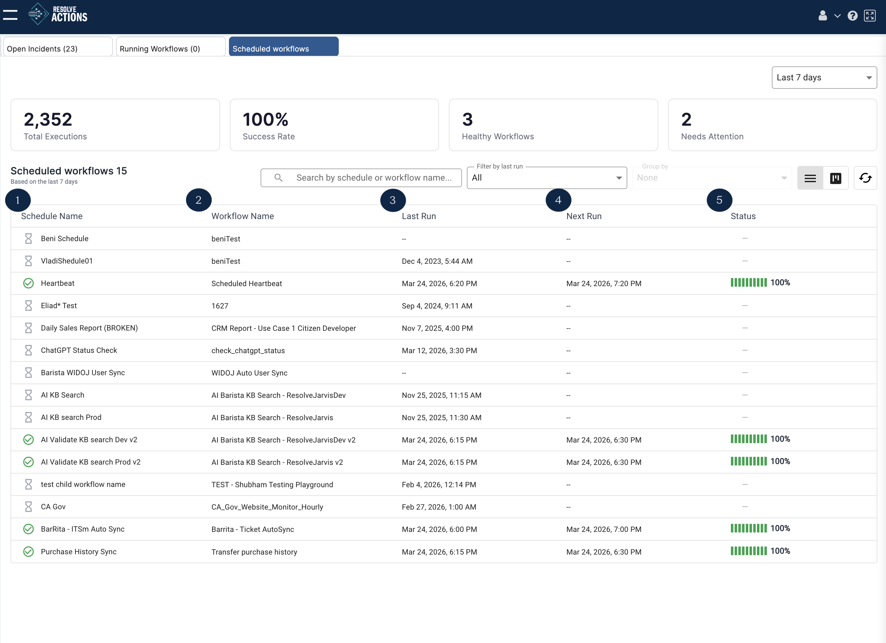
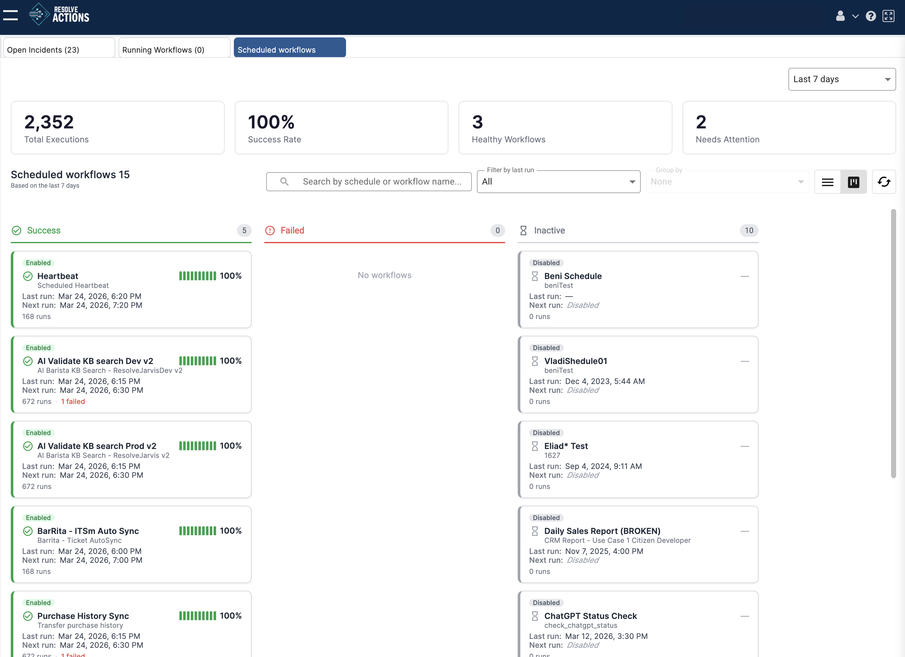
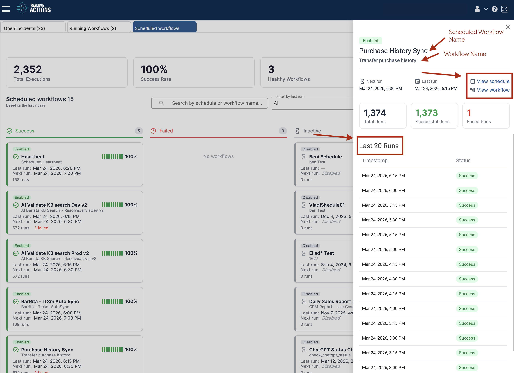

### Understanding the Scheduled Workflows Dashboard

The Scheduled Workflows list displays all actively scheduled workflows, including the most recent and next run times.

The default view for the dashboard includes: 

1. **Total executions** - The number of times all scheduled workflows have run based on the time period specified.
2. **Success rate** - The percentage of scheduled workflow runs that completed successfully.
3. **Healthy workflows** - The current number of workflows running without errors.
4. **Needs attention** - The number of workflows that require configuration edits.
5. **Search bar** - Search by workflow name or schedule name.
6. **Filter and group by** - Organize and sort the scheduled workflows list.

#### View Options

The dashboard includes options to toggle between List View and Card view and the option to Refresh.

1. **List View** - Toggle to list view.
2. **Table View** - Toggle to table view. 
3. **Refresh** - Update the status of all scheduled workflows in the table.

### List View

List view shows all scheduled workflows in columns. 

1. **Schedule Name** - The name of the schedule as defined in the Schedules and Triggers menu.
2. **Workflow Name** - The name of the workflow associated with the schedule.
3. **Last run** - The date and time of the most recent workflow run.
4. **Next run** - The date and time of the next scheduled run.
5. **Status** - The percentage of runs that completed successfully.

### Card View

Card view organizes workflows into three columns: **Success**, **Failed**, and **Inactive**. Results are segmented into "Success" and "Failed" based on their last run.

Each card displays a visual representation of the success rate, the workflow name and description, the last and next run times, and the total number of runs. 

#### Details

Clicking a schedule name in list view, or a card in table view, opens a side panel with run times, run statistics, and the following additional information:

- **Scheduled Workflow Name**: The name of the schedule.
- **Workflow Name**: The name of the workflow. 
- **Last 20 Runs**: A list of the last twenty runs
- **View schedule**: A link to the schedule configuration
- **View workflow**: A link to open the workflow in the Workflow Designer

