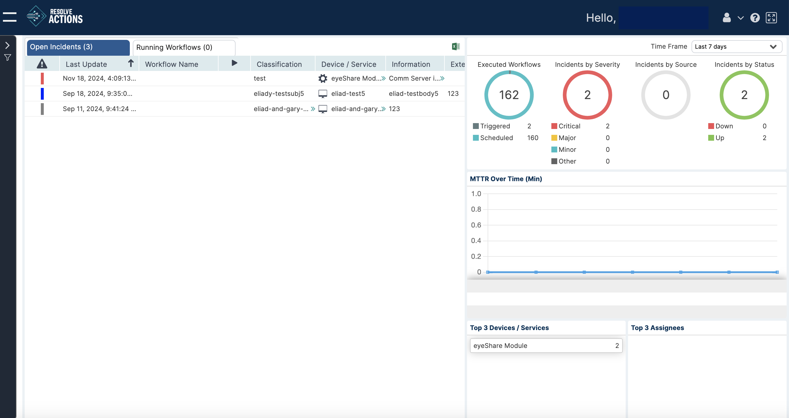

## Introduction

VAR::PRODUCT_FULL LIVE is the Resolve Actions dashboard page. It displays events and alerts from the control and monitoring systems. The dashboard is a dynamic environment responding to changes in real time.

The Actions LIVE dashboard is illustrated in the following figure:

It provides a central display of changes: open incidents, running workflows, real-time KPIs and statistics. You also use it to manage critical events and take action to prevent degradation of critical operations and services.

In the dashboard, two real time displays are accessible from the two top left hand tabs, **Open Incidents** and **Running Workflows**.

Gauges and graphs are displayed on the right hand side of the window. They provide cumulative statistics about Resolve Actions performance.

For more on each dashboard, see
- [Open Incidents](./open-incidents)
- [Running Workflows](./running-workflows)
- [Scheduled Workflows](./scheduled-workflows)