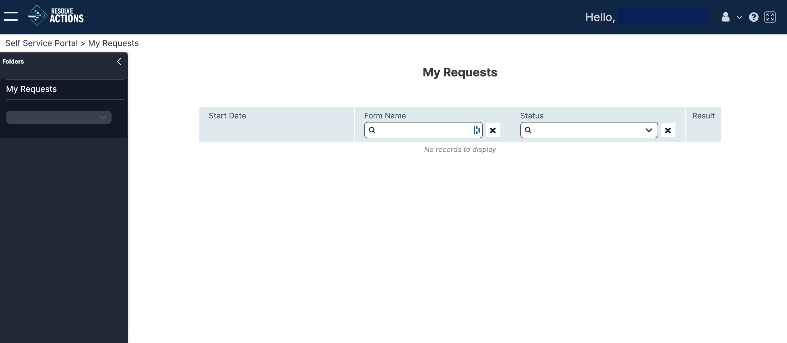
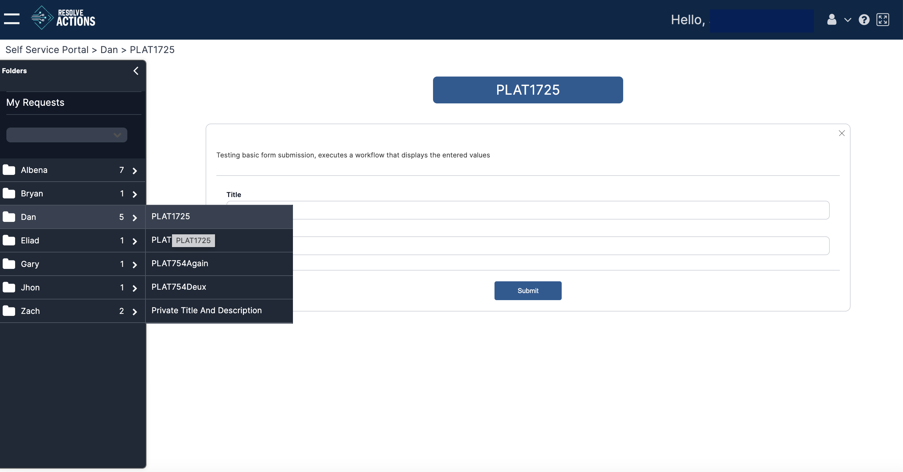

:::note
All forms that you have permission to see are visible here. For details about permissions, see [Setting Permissions on a Form](../../Self-Service-Designer/Setting-Permissions-on-a-Form.mdx).
:::

1. From the left navigation pane, select the relevant folder.
   
2. Select the form you want to launch.  
   
3. Populate each field with your input.
4. Click **Submit** to launch the form.

Depending on the form, it may also contain an [additional input dialog](../../../Activity-Repository/Self-Service/self-service-input.mdx) that will pop up while the form is being launched.