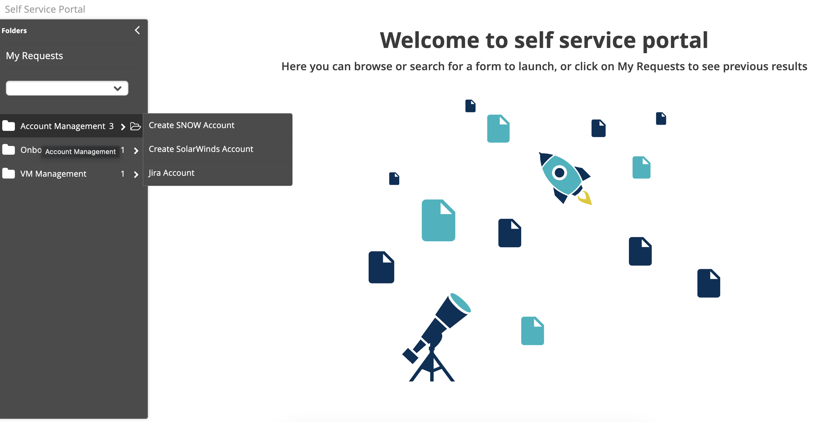
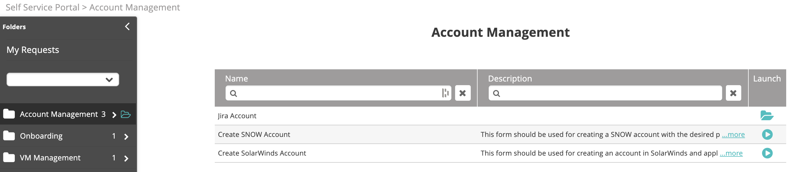
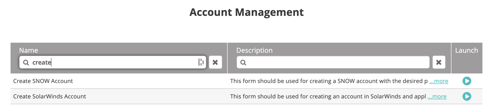

1.  From the left navigation pane, hover over the relevant folder. Clicking on it will display its contents, including forms and subfolders.
    
2.  Click the folder icon to open its content.
      
    Contents are shown with subfolders listed first in alphabetical order, followed by forms listed in alphabetical order.

3.  You can filter the forms/subfolders by **Name** and/or **Description**. Enter the desired search term in the respective search field and press **Enter** to filter the displayed results by this term. Searching in the **Name** field will apply the filter to the name of the subfolder or form. Searching in the **Description** field will apply the filter to the description of the form. Both fields can be used together to further refine results.

    

    To clear the search results and see all subfolders and forms again, click the **X** icon next to the search field.
4.  To execute a form, click the **Launch** icon to the right of the form. To view the content of a subfolder, click the **Folder** icon to its right.
