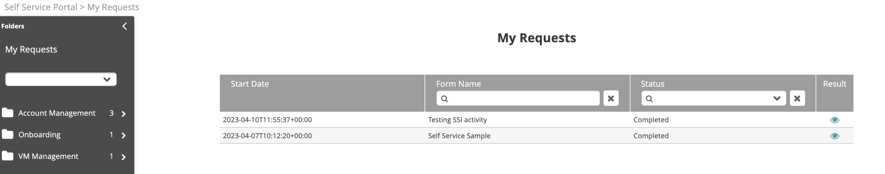

1.  In the navigation pane, click **My Requests**.  
    A list of all form requests that you have executed will open, displayed with their status (Completed or Waiting). You can also view the result returned by each request.
    
2.  You can filter the requests by:
    * Form Name—Type the form name and hit the **Enter** key to display the desired form.
    * Status (Completed/Waiting)—Click the down arrow to select the desired status.
3.  To view the request results, click the **Result** icon to the right of the respective request.
