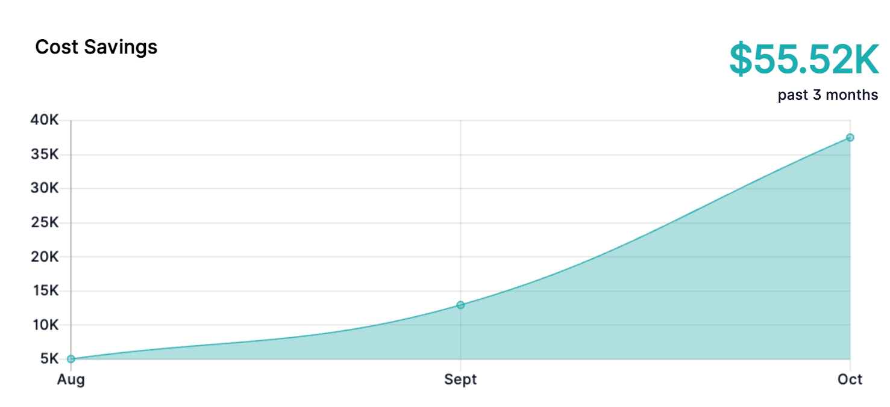
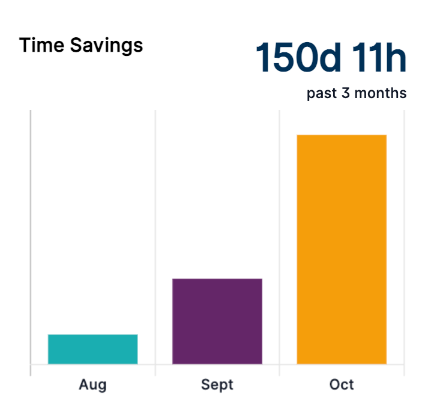
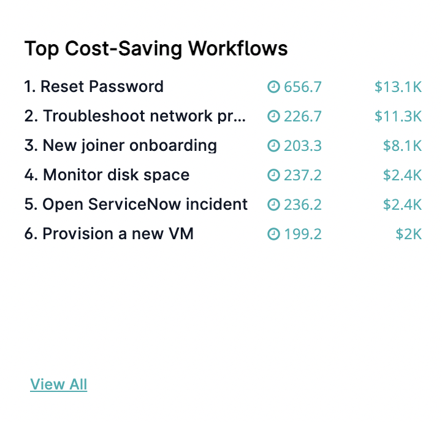
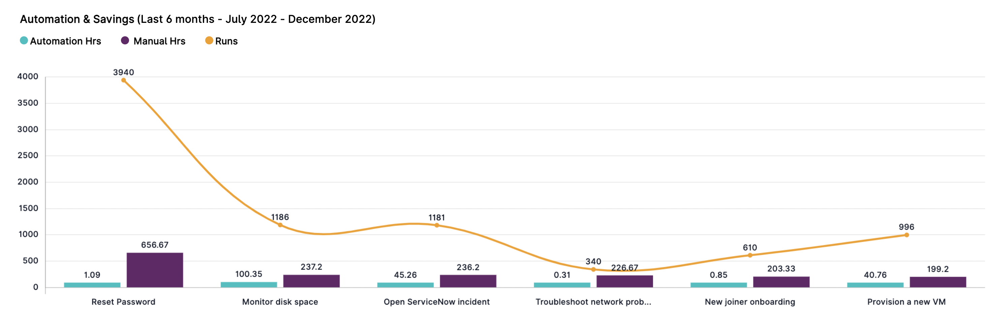

The Analytics Dashboard consists of various charts that visualize your ROI from different angles such as statistics on cost and time savings when automation is used compared to manual workflow execution.

Before you can view the charts, [provide base numbers](./specifying-workflow-costs.mdx) reflecting the costs that executing the workflows manually used to incur.

:::note
The numbers representing workflow executions on the Analytics Dashboard might differ from the totals shown on the **Configuration > License Details** page under **General License Details**.

* The numbers shown on the **Analytics Dashboard** include completed workflow executions initiated through a trigger, a schedule, or from the Self Service Portal. Manual executions are not included.
* The numbers shown on the **License Details** include completed workflow executions initiated either manually or through a trigger, a schedule, or from the Self Service Portal.

Further divergence might occur because of how the calculation periods are timed. The two screens use different criteria for the day's start and end which can send the same execution into the previous or the following calculation period.
:::

## Selecting the Chart's Time Period

The Analytics Dashboard charts can be displayed for different time periods. The period selection applies to all charts on the page.

Select the time period from the drop-down menu in the header. You can choose from the following possible values:

* Last 30 days
* Last 3 months
* Last 6 months
* Last 12 months
* Custom range (select a date range from the calendar)
    
:::note
The historical data will be limited to a maximum of `180` days if you are using the Analytics Dashboard immediately or soon after its rollout to your system. Over time, the newly collected data will allow you to view up to 12 months of analytics data.
:::

## Cost Savings Chart

The **Cost Savings** chart displays cost savings realized when using automation for a selected time period. The chart is calculated based on the values of Cost Per Hour, Average Time To Complete (manual), and the Run Count.

Cost saving is calculated with the following formula:

`Saved cost = (CostPerHour * AvgTimeToComplete / 60) * RunCount`

Where:

* `CostPerHour` is the manual cost per hour
* `AvgTimeToComplete` is the average manual time (in minutes) required to complete a workflow
* `RunCount` is the number of workflow runs for the selected time period
    
:::caution
The Cost Savings chart shows a summary cost savings number for all workflows.
:::

## Time Savings Chart

The **Time Savings** chart displays the saved manual time to complete a task when automation is used.

Time savings are calculated with the following formula:

`Time saved = sum(AvgTimeToComplete * RunCount / 60)`

Where:

* `AvgTimeToComplete` is the average manual time (in minutes) required to complete a workflow
* `RunCount` is the number of workflow runs for the selected time period
    

## Top Cost-Saving Workflows Chart

The **Cost-Saving Workflows** chart shows saved manual hours and cost per workflow when automation is used.

:::caution
The chart shows only the top 10 cost-saving workflows.
:::

Click **View All** to see a graphical representation of all workflows executed at least once.

## Automation and Savings Chart

The **Automation & Savings** bar chart shows the comparison between the manual and automation times required to complete a workflow.

The **Manual Hrs** bar for each workflow represents the manual hours it would have taken for the workflow to be run by a person, multiplied by the number of runs for the selected time period. Learn how to [set manual workflow cost](./specifying-workflow-costs.mdx).

The following formula is used:

`Manual hours = sum(AvgTimeToComplete * RunCount) / 60`

Where:

* `AvgTimeToComplete` is the average manual time (in minutes) required to complete a workflow
* `RunCount` is the number of workflow runs for the selected time period

The **Automation Hrs** bar for each workflow represents the automation hours it took the workflow to be completed by VAR::PRODUCT_FULL automation, multiplied by the number of runs for the selected time period.

The following formula is used:

`Automation hours = sum(AvgAutoTimeToComplete * RunCount) / 60`

Where:

* `AvgAutoTimeTоComplete` is the average automation time (in minutes) required to complete a workflow
* `RunCount` is the number of workflow runs for the selected time period
    
The workflows in the chart are ordered by automated hours starting with the highest. All calculations are based on the selected period in the header. The complementary orange line inside the chart shows the number of runs for each workflow for the selected time period.

