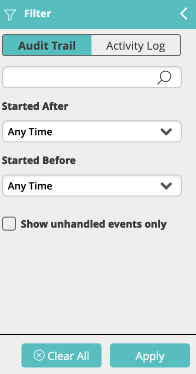

The Filter panel allows you to easily locate events and activities from the Audit Trail log.

To filter events and activities:

1.  Expand the left panel.  
    The filter pane appears:  
    
2.  Click the **Audit Trail** tab to filter the event list or the **Activity Log** tab to filter the activity list.  
    When the filter pane is open, the relevant table is surrounded by a teal frame. A filtered table is indicated by the funnel icon in front of the panel title.
    :::note
    Not every event will run a workflow, but every event will appear in the audit trail log.
    :::
    
    :::note
    The activity log can either:
    * Indicate that an event was dropped (since it did not qualify to run a workflow)
    * Display the full details of each activity that was executed by the workflow.
    :::
3.  Use the available fields to enter the filtering criteria.
    :::note
    The free-text field in the audit trail filter pane searches for the following fields: Workflow Name, Schedule or Trigger, Source Module, Message Source, Message Subject, Message Body and Event Number.
    
    The free-text field in the activity log filter pane searches for the following fields: Activity Name (the name of the activity instance), Branch, Workflow Group, Workflow, and Result.
    :::
4.  Click **Apply** to filter the list of entities.