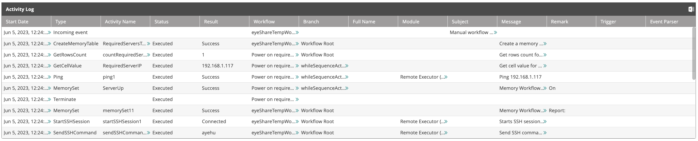

## Understanding the Activity Log

The Activity Log table displays a detailed list of activities related to the selected event: the event's starting time and the execution of each activity in the triggered workflow.

## Displaying the Activity Log

From the upper table, click the row of an event. The activity log table will display the activities for the selected event:

The list provides the following information about the activities:

- **Start Date**—Event start date and time.
- **Type**—The type of event: incoming, scheduled, etc.
- **Activity Name**—The name of the activity instance.
- **Status**—The status (indicates whether the activity was successfully invoked).
- **Result**—Some workflow activities produce an output result: True/False, Success/Failure, a numeric value, a textual value, a code fragment, an output message or a table. If the resulting text exceeds the field size, the double-arrow icon  will appear and will display the activity's result in a dialog box when clicked.
- **Workflow**—The name of the workflow that was triggered by the event.
- **Branch**—If the activity was initiated in a n if/else branch, it will be noted here.
- **Full Name**—If the activity belongs to the Communication category, this field will display the full name of the user who received the notification.
- **Module**—The origin module (if the event originated from a module).
- **Subject**—The subject of the email that invoked the event.
- **Message**—The content of the email that invoked the event. If the message text exceeds the field size, the double-arrow icon  will appear and will display the full message in a dialog box when clicked.
- **Remark**—A system message regarding the execution of the activity.
- **Trigger**—Trigger and trigger condition IDs, when present.
- **Event Parser**—In case of an event or an incident, the [event parser](../../../Product-Navigation/Repository/Incident-Configuration/Event-Parsers.mdx) that determined it.

:::note

- Clicking a column sorts the list of activities according to the column chosen.
- Click the Excel icon to export the log to a spreadsheet file.

:::

### Copy Activity Log Data
To copy the content from the activity log:

1. Click the double-arrow icon  to display the activity's result in a dialog box.
2. Click the copy to clipboard icon  to copy all the information.