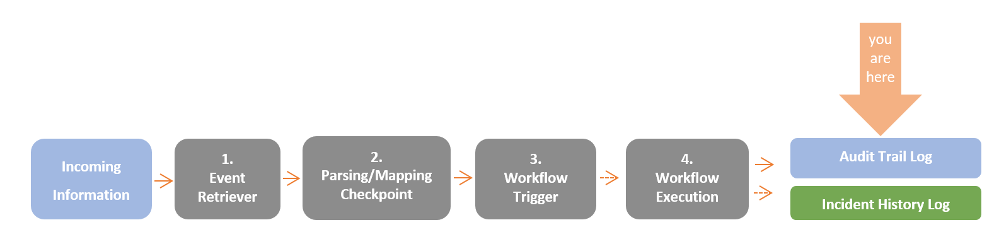
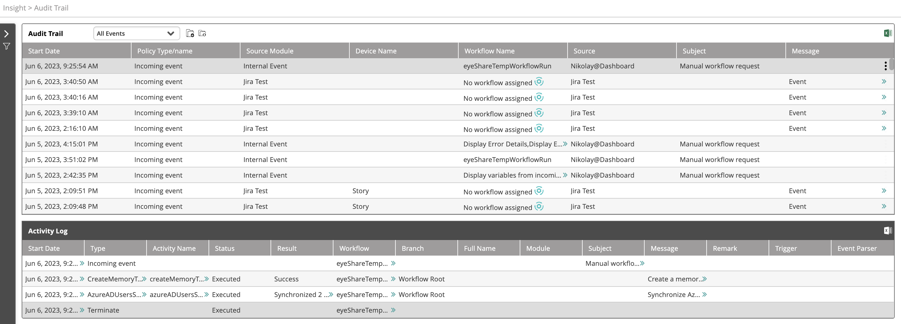
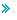
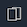
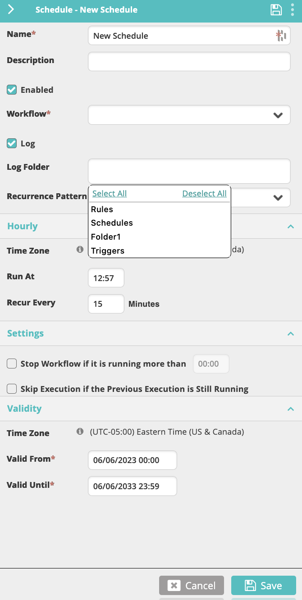
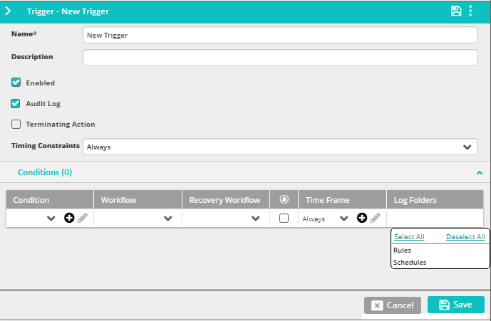

The Audit Trail screen displays the list of events (external events, scheduled actions, triggers, Self Service requests and manual workflow executions) audited by VAR::PRODUCT_FULL. The events are registered to the Audit Trail log along with the source module which triggered them, the workflow that was invoked as a result and other useful Information.

The Audit Trail log is divided into two: the upper table displays the list of events (external events, scheduled actions, triggers, Self Service requests and manual workflow executions), and the lower table displays the activity log of each event: the event's starting time and the execution of each activity in the triggered workflow. 

## Displaying the Event Log

From the top menu, go to **Insight > Audit Trail**. Open the Audit trail log. The list of events will appear in the upper table.

The top list provides the following information about each event:

* **Start Date**—Event start date and time.
* **Schedule or Trigger/Name**—Type of event: incoming event, scheduled, etc.
* **Source Module**—The source module when the event originates from a module.
* **Device Name**—The name of the mapped device/service if the event was classified as an incident.
* **Workflow Name**—The name of the workflow that was triggered by the event (if one was triggered). Unautomated events show а circular workflow icon for easier visual tracing. See [Automating Unautomated Events](#automating-unautomated-events) to learn how to automate such events.  
  :::note
  The name **eyeShareTempWorkflowRun** indicates that the workflow execution was done manually from the Designer and not triggered by an external event.
  :::
* **Source**—The address of the mailbox from which the event was invoked.
* **Subject**—The subject of the email that invoked the event.
* **Message**—The incoming information that was retrieved (by email or any other method) that invoked the event.

### Copy Audit Trail Data
To copy the content from the audit trail:
  1. Click the double-arrow icon  to display the activity's result in a dialog box.
  2. Click the copy to clipboard icon  to copy all the information.

## Managing the Event Log

To choose an event for management, click anywhere in its line in the list. Notice that a three-dot menu appears at its right end. Clicking it opens an actions list with the following actions:

*   **Stop Workflow** - Stops the workflow that has been selected to automate the event, if it is running.
*   **Automate Event** - On unautomated events, starts a wizard that allows you to select a workflows to automate the event.
*   **Open Workflow Designer** - When a workflow has been assigned to automate the event, this command opens the workflow in the **Workflow Designer**. This action is disabled when no workflow was invoked.
*   **Open Repository** - When a workflow has been assigned to automate the event, this command opens the workflow repository at the folder where the workflow is saved. This action is disabled when no workflow was invoked.
    
Part of these actions can also be accessed from the **Audit Trail** toolbar. It adds the following common action:

*   **Export to Excel** - Exports the full Audit Log in a Microsoft Excel spreadsheet.
    
## Managing Audit Trail Folders

You may filter the Audit Trail events and activities by [using the filtering panel](./filtering-events-and-activities.mdx). However, to add another level of categorization and filtering to the display, you should use Audit Trail folders. After creating the Audit Trail folders you may associate incoming events to the folders and then, when viewing the Audit Trail log, filter out any events that are not associated with them.

### Creating Audit Trail Folders

To create an Audit Trail Folder:

1.  From the top bar, click the Add Folder icon.  
2.  In the text box, enter the name of the new folder (for example: "Scheduled Events") and click **Create**.

You can now apply scheduled events to the new folder.
    
:::note
This feature is used in [Schedules](../../../Product-Navigation/Repository/Schedules-and-Triggers/Schedules.mdx#managing-scheduled-workflows) and [Triggers](../../../Product-Navigation/Repository/Schedules-and-Triggers/Triggers.mdx#managing-triggered-workflows), as shown respectively, in the following figures:

:::

### Removing Audit Trail Folders

To remove an Audit Trail folder:

1.  From the top bar, click the **Remove Folders** icon.
2.  In the list that appears, check the folder or folders that you want to delete and click **Delete**.

### Filtering the Audit Trail

To filter the Audit Trail display using folders:

1.  From the top bar, open the list next to the **Audit Trail** title.  
    The list contains all folders that you created as well as the **All Events** entry that is always visible.
3.  Select the folder that you want to display.  
    Log entries linked to events that are not stored in the selected folder will be filtered out from the display.

## Automating Unautomated Events

The quickest way to automate an event is from the **Audit Trail** screen. You can start a wizard that allows you to select a workflow to use together with conditions and triggers.

<!--The quickest way to automate an event is from the **Audit Trail** screen. You can start a wizard that utilizes AI to recommend suitable workflows to use and allows you to select conditions and triggers.

:::note
The ML (Machine Learning) model responsible for suggesting workflows needs training, meaning its initial suggestions might not be as good.

Training is automatic and does not require any input from you. However, how quick it will train depends on the frequency of events and on your assigning workflows to them. The more events you automate, the faster the model will learn.
:::
-->

Take these steps to automate an event from the Audit Trail screen:

1.  Find an unautomated event and from its Actions menu, select **Automate Event**.  
    The **Automate Event** wizard appears.
    :::note
    Unautomated events show **No workflow assigned** and a circular workflow icon in their **Workflow Name** column.
    :::
2.  On the **Workflow** screen, select an existing workflow to handle the event and then click **Next**.
    <!--*   In **Recommended Workflows**, you can select from a list of AI-driven recommendations. The closest matches appear at the top.
    *   In **Browse & Select**, you can select from the full list of available workflows.-->
3.  On the **Condition** screen, select the condition that you need the event to match and then click **Next**.
    *   To create a new condition, click the plus sign at the top.
    *   To modify an existing condition, select it and then edit the details in the panel on the right.  
    
    See [Conditions](../../../Product-Navigation/Repository/General/Conditions.mdx) for more information on creating and using conditions.
4.  On the **Trigger** screen, create or select a trigger that you need the event to match and then click **Next**.
    *   To create a new trigger, click the plus sign at the top.  
        The workflow and the condition that you selected on the previous screens are automatically included.
    *   To modify an existing trigger, select it and then edit the details in the panel on the right.
    *   Ensure that the trigger uses the condition that you created on the **Condition** screen. You can also add extra conditions.
    
    See [Triggers](../../../Product-Navigation/Repository/Schedules-and-Triggers/Triggers.mdx) for more information on using and managing triggers.
5.  On the **Confirm** screen, double-check your selection and click **Confirm & Save**.
6.  Finally, click **Close** to automate the event.
    
After the event is automated, you see the selected workflow name under the **Workflow Name** column.

To unautomate an event, edit its [trigger](../../../Product-Navigation/Repository/Schedules-and-Triggers/Triggers.mdx) and either disable it or remove the condition-workflow combination from it (provided the trigger also uses additional conditions).