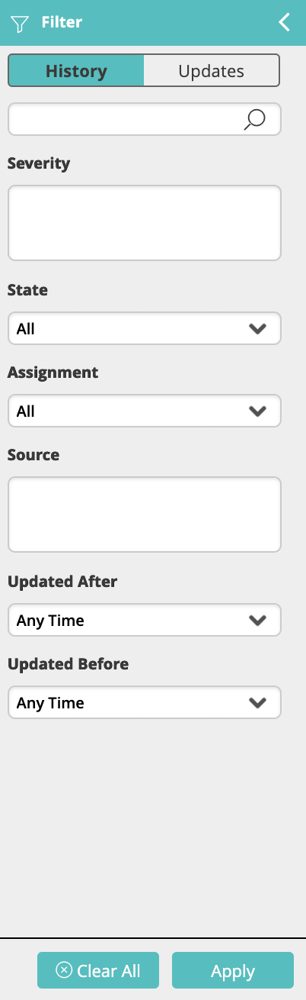

The Filter panel allows you to easily locate incidents and updates from the Incident History log.

To filter incidents and updates:

1.  Expand the left panel.  
    The filter pane appears:  
    
2.  Click **History** to filter the incident list or **Updates** to filter the list of updates.
3.  Use the available fields to enter the filtering criteria.  
    You can filter the incident history list by the severity, state, assignment and update time of the incident. You can filter the update log with free text.  
    :::note
    The free text field in the incidents filter pane searches within the following fields: Device/Service Name, Classification, Information, Workflow Name, Assignee and External ID. 
    
    The free text field in the updates filter pane searches within the following fields: Information and Workflow Name.
    :::
4.  Click **Apply** to filter the list of records.