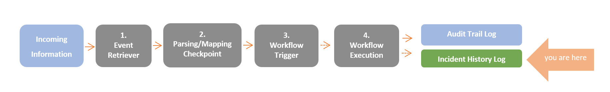
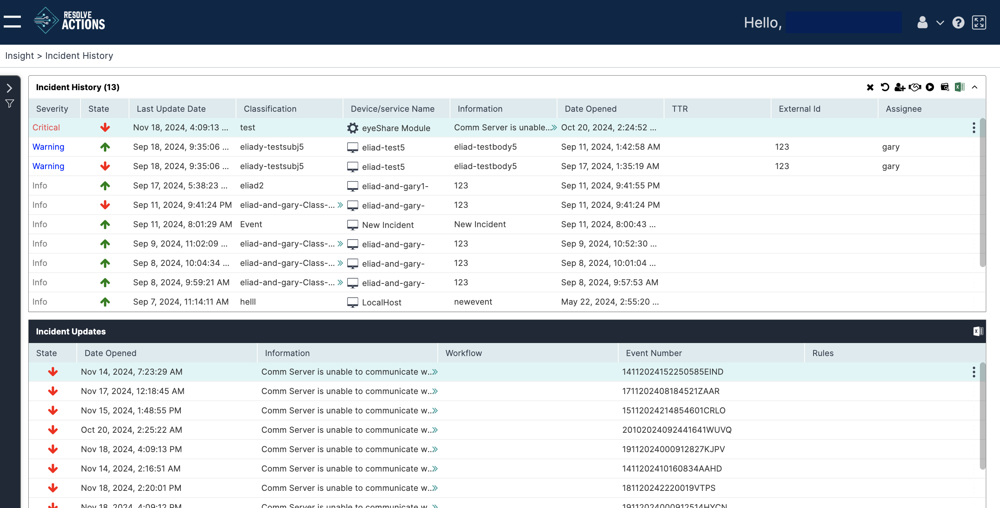
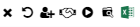

The Incident History screen displays the list of events that were classified as incidents by VAR::PRODUCT_FULL. The incidents are registered to the Incident log along with their type, classification, workflows that were invoked as a result, and other useful information.

The Incident History screen is divided into two: the upper table displays the list of Incidents, and the lower table displays their updates.

## Displaying the Incident Update Log

From the top menu, go to **Insight > Incident History**. The list of incidents will appear in the upper table.

The top list provides the following information on each incident as follows:

- **Severity**—One of Info, Minor, Warning, Major, Critical
- **State**— Up,  Down
- **Last Update**—The last time the incident was updated
- **Classification**—Incident type
- **Device/Service Type & Name**—Incident source - device or service and name
- **Information**—A brief explanation of the nature of the incident
- **Workflow Names**—A list of workflows invoked as a result of the incident
- **Date Opened**—The date on which the incident commenced
- **Ttr**—Time to Recover - displayed for recovered incidents
- **External ID**—An external ID of the incident.  

  For incidents that are parsed using the [Event Parsing](../../../Product-Navigation/Repository/Incident-Configuration/Event-Parsers.mdx) mechanism or created using the [New Incident](../../../Activity-Repository/Incidents/Actions/new-incident.mdx) activity, the external ID is created automatically. For incidents that were created by mapping (using one of the built-in integrations), the external ID is the value mapped by VAR::PRODUCT into the module configuration. It is an internal procedure that allows applying a distinctive ID to every incident.

  Example: If the integration is a ticketing system, the external ID can be mapped to the ticket ID. By doing so, every time a new ticket is created, a new incident will be created also, regardless of the Device/Service and Classification combination.

- **Assignee**—Name of user if incident assigned to another user

:::note
*   You can drag and drop the column headers to rearrange the list.
*   Clicking a column sorts the list of updates according to the column chosen.
:::

## Managing the Incidents Log

To choose an Incident update for management, click anywhere in its line in the list. Notice that the actions menu (three vertical dots) is visible at the far right. Clicking it opens an actions list.

The same actions can be accessed from the icons on the top right of the Incident History list:

The icons operate on the selected Incident. Their use is as follows:

| Icon|Description|
|---|---|
|  | Close the incident |
|  | Reset the incident |
|  | Assign the incident to another user |
|  | Take ownership of the incident |
|  | Start the workflow assigned to the incident |
|  | Open the incident in the Audit Trail |
|  | Export the log to an Excel file |