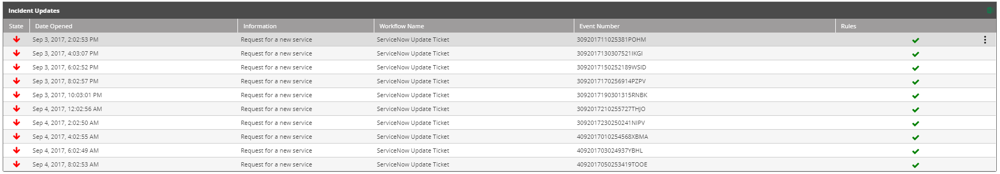

The Incident Updates table displays a detailed list of updates related to the selected incident.

## Displaying the Incident Updates

From the upper table, click the incident's row. The updates table will display the updates of the selected incident:

The list provides the following information:

- **State**—Resolved: , Pending: .
- **Date Opened**—The date and time of the update.
- **Information**—Details about the update.
- **Workflow Name**—The name of the workflow that was triggered by the incident
- **Event Number**—Provide by the system.
- **Rules**—Rules indicates that the incident went through the [trigger](../../../Product-Navigation/Repository/Schedules-and-Triggers/Triggers.mdx#managing-triggered-workflows) list.  

:::note

- You can drag and drop the column headers to rearrange the list.
- Clicking a column sorts the list of updates according to the column chosen.
- On the right of the title bar, there is an Excel button  that you can use to save the displayed list to a spreadsheet file.

:::

## Managing the Incident Updates

To choose an Incident update for management, click it anywhere in its line in the list. Notice that a three-dot menu appears at its right end. Clicking it opens an actions list.

The menu actions are as follows:

| Icon | Description
| --- | --- |
|  | Assign the incident to another user |
|  | Take ownership of the incident |
|  | Start the workflow assigned to the incident.|
|  | Open the incident in the Audit Trail |