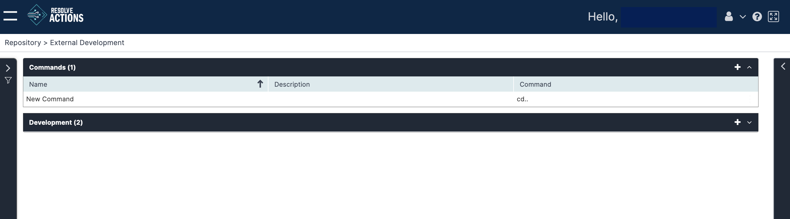

Choose **Repository > External Development** and open the **Commands** list. The following window is displayed:

The Commands list provides the following information:

| Column | Details |
| --- | --- |
| Name | Command name. |
| Description | Command description |
| Command | Command file name |

## Adding Commands

To add a command:

1. From the top right corner of the schedules list, click the plus icon.  
   The commands properties screen appears.
2. In the **Name** field, enter the name of the command.
3. In the **Description** field, enter a description for the command.
4. In the **Command** field, enter the file name of the command.  
   You can use **Browse** to locate a command file on your local computer.
5. In the **Arguments** field, enter any arguments for the command.
6. Choose a target device for the command from the **Run on Device** field.
7. Enter your name and password in to the **User Name** and **Password** fields.
8. Choose the **Return Type** from the list:
   :::note
   These are standard POSIX destinations. Typically, **STD out** and **STD err** are directed to the console device (your monitor). Use the **Exit Code** if your command is part of a chain of actions needing the exit code of the previous action.
   :::
9. Click **Save**.