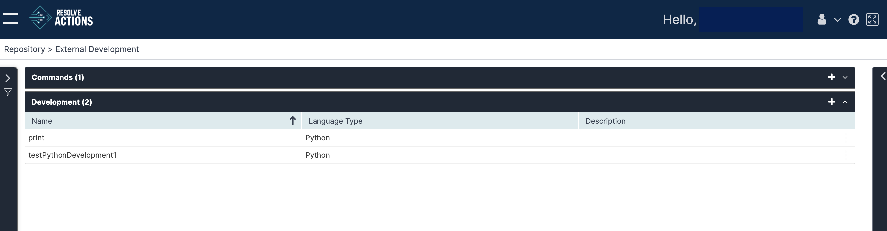

Choose **Repository > External Development** and open the **Development** list. The following window is displayed:

The Development list provides the following information:

| Column | Details |
| --- | --- |
| Name | Program name |
| Language Type | C#, VB.NET, or Python |
| Description | Program description |

The only available action icons are **New** and **Delete**.

## Adding a Development Program

To add a development program:

1. From the top right corner of the schedules list, click the plus icon.  
   The development program properties screen appears.
2. In the **Name** field, enter the name of the command.
3. In the **Language** field, enter a description for the command.
4. In the **Assembly List table** you will need to add the relevant DLL files required by your program.
5. In the **Code** area, you can write your code or paste it from an external tool.
6. When you click **Save**, the compiler will run.
   Save will only work if you have an error-free compile.
