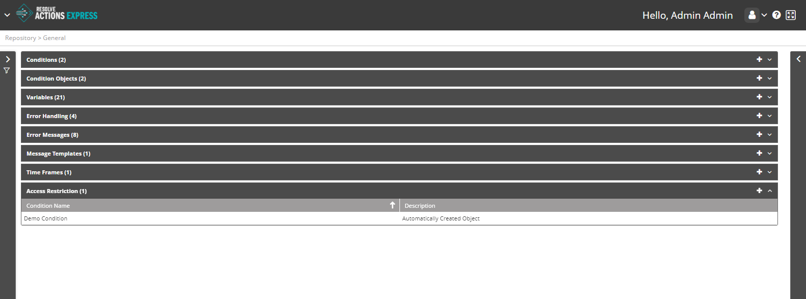

## Understanding Access Restriction

If you are an VAR::PRODUCT_FULL administrator, you may want to block some of the arriving events and prevent them from appearing in the [Audit Trail](../../Insight/Audit-Trail/viewing-the-audit-trail-log.mdx) log. Access restriction objects allow you to do so. When an incoming event matches the [condition](./Conditions.mdx) selected by one of the access restriction objects, it is dropped and ignored and no log entry is registered to the Audit Trail log. 

Choose **Repository > General** and open the **Access Restrictions** list. The following window is displayed:

## Managing the Access Restrictions

The access restriction list provides the following information:

| Column | Description |
| --- | --- |
| Condition Name | The name of the condition to be used to restrict incoming events. |
| Description | Description of the access restriction object |

To add an access restriction object:

1. Click the plus icon.  
   The Access Restrictions properties window appears.
2. In the **Condition Name** field, select the condition that an incoming event must meet to be restricted from the audit trail log.  
   :::note
   You may only apply a "Simple" [condition](./Conditions.mdx) to the Access Restriction; that is, a condition that combines one or more of the following objects: Body, Subject, Source, Destination, and another Condition object.
   :::
3. In the **Description** field, enter a description for the access restriction object.
4. Click **Save**.