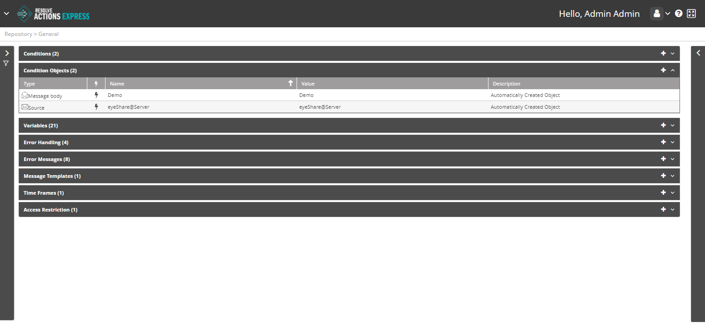

## Understanding Condition Objects

Condition objects are constant values which represent an incoming event's segments (an email, a text message, an integrated module event, etc.). They are used to assemble a condition: You may compare the value of a variable against the value of a condition object to create a condition.

:::note
To learn more about conditions refer to [Conditions](./Conditions.mdx).
:::

Choose **Repository > General** and open the **Condition Objects** list. The following window is displayed:

## Managing Condition Objects

The condition object list provides the following information:

| Column | Description |
| --- | --- |
| Type | Condition Object type (Destination, Message Body, Source, Subject) |
|  | Created automatically -  or manually -  |
| Name | Condition Object name |
| Value | Value assigned to the Condition Object |
| Description | Condition Object description.

To add a condition object:

1. Click the plus icon.  
   The Condition Object properties window appears.
2. Enter the condition object's **Name**.  
   For example: "John's cell number".
3. In the **Description** field, you can enter the condition object's description.
4. In **Type**, select one of Destination, Message Body, Source, or Subject.
5. In **Value**, type in the object's default value (for example: john's phone number).
6. Click **Save**.
   