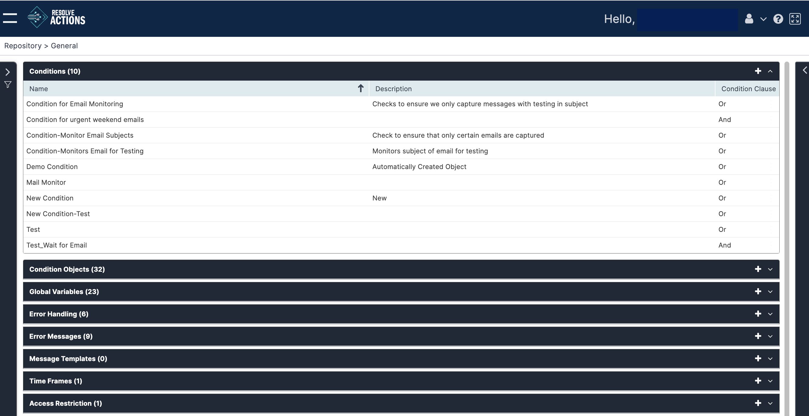
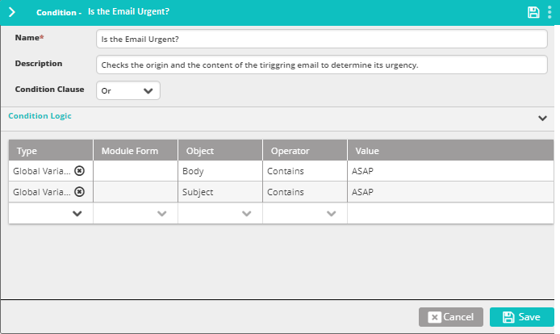

## Understanding Conditions

Conditions are logical states that assist in defining the VAR::PRODUCT_FULL reaction to incoming events. A Condition may be based, for example, on a message property (source, body, etc.). When conditions are met a workflow may be triggered and other actions may automatically be performed.

Choose **Repository > General** and open the **Conditions** list. The following window is displayed:

## Managing Conditions

The condition list provides the following information:

| Column | Description |
| --- | --- |
| Name | Name of the condition |
| Description | Description of the condition |
| Condition Clause | And/Or |

### Adding Conditions

To add a condition:

1. Click the plus icon.  
   The Conditions properties window appears.
2. Enter the condition's **Name**.  
   For example: "Is the email urgent?".
3. In the **Description** field, you may enter the condition's description.  
   For example: "Checks the origin and the content of the triggering email to determine its urgency".
4. Under **Condition Logic**, set the condition.  
   In the following example, the condition is composed of two arguments (with an OR clause): one argument checks whether the incoming email address is `david.smith@resolve.io` and the other checks whether the email body contains the phrase `ASAP`.  
   
5. Optionally, add more arguments to the list:
   1. Under **Type**, select:
      * **Global Variable** to select one of the built-in or customized variables.
      * **Standard Object** to select any of the hard-coded elements of Resolve Actions or any of the integration modules to select properties from the module's form (in the example provided above, global variables were selected).  
      See [Available Standard Objects](#available-standard-objects) for a list.  
      :::note
      For more information on variables refer to [Understanding Variables](./variables). For more information on integration modules, refer to [Integrations and Modules](../../../Product-Navigation/Configuration/Integrations-and-Modules/understanding-integrations-and-modules.mdx).
      :::
   2. If a specific integration module was selected in the previous step, under **Module Form** select the property to check.
   3. Under **Object**, select the variable, standard object or property to check (in the example given above - **Source** and **Body** were selected).
   4. Under **Operator**, select the relevant logic operator (in the example given above - **equals** and **contains**).
   5. Under **Value**, set the value to compare with.
6.  Click **Save**.

## Available Standard Objects

The following table shows the available **Standard Objects**:

import Admonition from '@theme/Admonition';

| Object Name | Description |
| --- | --- |
| Classification | The [classification](../Incident-Configuration/Classifications.mdx) (type) of the incoming event. |
| Condition | Another condition. <Admonition type="note">
Use Condition Standard Object to link rules or merge **AND** conditions with **OR** conditions.
</Admonition> |
| Destination | The recipient of the triggering message. |
| Device | The [device](../Incident-Configuration/Devices.mdx) (server) on which the reporting event occurred. |
| Incident | The current [incident](../Incident-Configuration/Incidents.mdx). |
| Message Body | The text of the triggering message. |
| Service | The [service](../Incident-Configuration/Services.mdx) in which the event occurred. |
| Source | The source of the triggering message. |
| Subject | The subject of the triggering message. |
| Time Frame | The [time frame](./Time-Frames.mdx) during which the condition applies. |