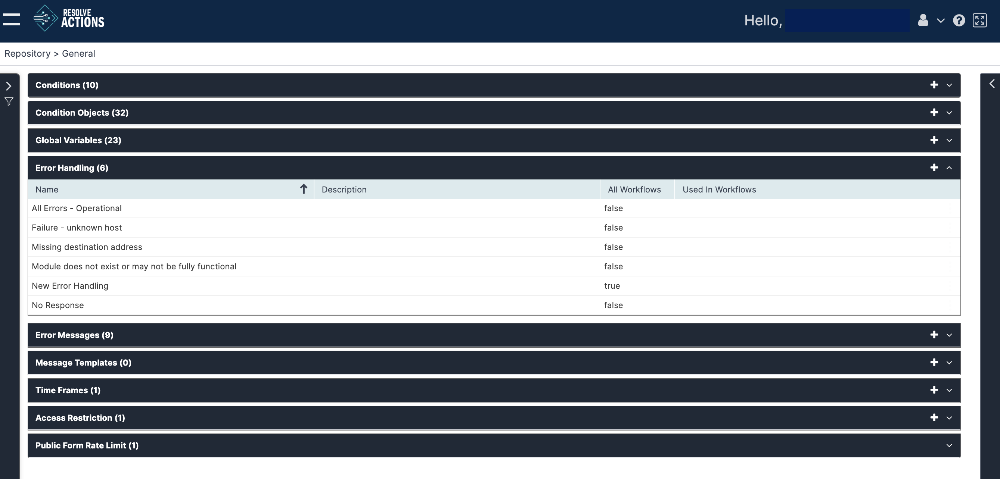

## Understanding Error Handling

An error handling object is a rule activated upon an activity's error status during workflow execution. In the error handling rule you may decide how the workflow continues upon error detection:

*   Continue to the next activity
*   Go to a specific activity in the current workflow
*   Return an error message
*   Run the workflow in the background
*   Stop the workflow immediately
*   Stop the workflow immediately and run another workflow in the background

Choose **Repository > General** and open the **Error Handling** list. The following window is displayed:

## Managing Error Handling Rules

The error handling rule list provides the following information:

| Column | Description |
| --- | --- |
| Name | Name of the error handling object |
| Description | Description of the error handling object |
| All Workflows | |
| Used in Workflows| |

To add an error handling rule:

1.  Click the plus icon.  
   The Error Handling properties window appears.
2. Enter the error handling rule's **Name**.  
   For example: "Unknown Host".
3. In the **Description** field, you can enter the description of the error handling rule.
4. Check **Apply to All Workflows** to apply the rule to all workflows.
5. Under **Error Messages**, select the messages that will be sent when this error rule is activated.  
   :::note
   To create new Error Messages refer to [Managing Error Messages](./Error-Messages.mdx).
   :::
6. In the **Retry Activity** field, set the number of attempts to run the failing activity before handling the error.  
   :::note
   This parameter does not apply to communication activities.
   :::
7. In **Action**, select the error handling method:
   * **Continue to next activity** - Continue to the next activity following the one which indicated the error
   * **Go to Specific Activity in Current workflow** - Go to a specific activity in the current workflow and skip the activities following the one that indicated the error. In this case, select the activity.
   * **Return error message** - Return an error message. In this case, compose a message.
   * **Run Workflow in Background** - Run a workflow in the background. In this case, select the workflow to run.
   * **Stop Workflow Immediately** - Stop the workflow immediately.
   * **Stop Workflow Immediately And Run Workflow** - Stop the workflow immediately and run the selected workflow. In this case, select an alternative workflow to run.
8. Click **Save**. The new error handling rule is added to the list.