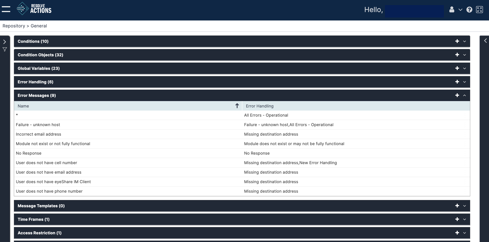

## Understanding Error Messages

Error Messages are the texts displayed or logged by Error Handling objects.

Choose **Repository > General** and open the **Error Messages** list. The following window is displayed:

## Managing Error Messages

The error message list provides the following information:

| Column | Description |
| --- | --- |
| Name | The error message text |
| Error Handling | The error handling rule to which the message is assigned |

To add an error message:

1. Click the plus icon.  
   The Error Messages properties window appears.
2. In the **Error Message Text** field, enter the message's display text.  
   For example: "Missing destination address".
3. Click **Save**.  
   The error message can now be used to [manage error handling rules](./Error-Handling.mdx).