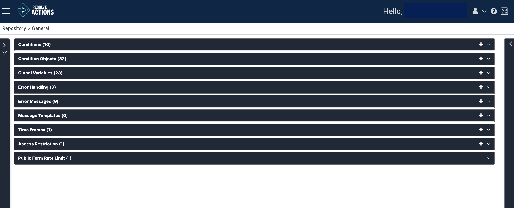

This section covers configuration of some of the basic objects of the VAR::PRODUCT_FULL system. Choosing **Repository > General** from the Navigation menu opens the following window:

The available actions for each of the General items are Add and Delete.

To avoid repetition, we will not refer to these icons again in the description of the General items. In each case, we will look in detail at the Add (plus icon) function.
