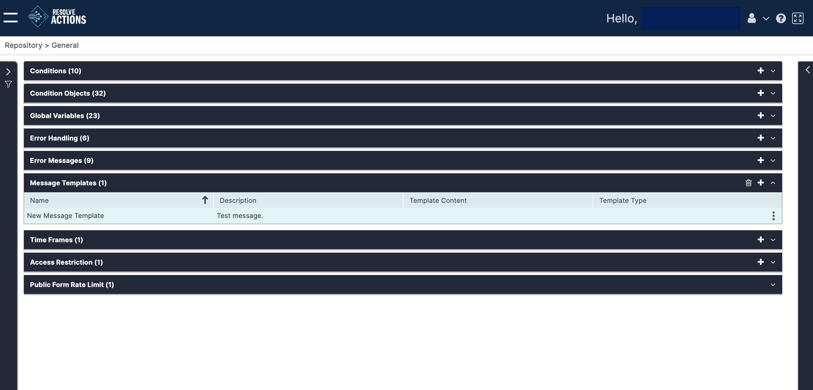

## Understanding Message Templates

Messages are used to contact recipients via Communication workflow activities. Message templates are generic message formats which present dynamic content by making use of variables for text replacement.

Choose **Repository > General** and open the **Message Templates** list. The following window is displayed:

## Managing Message Templates

The message template list provides the following information:

| Column | Description |
| --- | --- |
| Name |  Message template name. |
| Description | Message template description. |
| Template Content | Message template content. Currently, only **Down/General Message** and **Recovery Message**. You can define different message content for email and SMS delivery methods, within the same template. |
| Template Type | Message template type. Currently, only Email, SMS. |

To add a message template:

1. Click the plus icon.  
   The Message Templates properties window appears.
2. In the **Name** field, enter the name of the message template.  
   For example: "Server X is out of service".
3. In the **Description** field, enter a description for the message template.
4. Under **Down/General Message**, compose and design the message that will be sent (via email or SMS) upon incident detection.  
   To create a dynamic text, use the following convention: `%variable name%`, for example: `%hostname% is down. %Device% will be shut down within the next hour`.
5. Under **Recovery Message**, compose and design the message that will be sent (via email or SM) upon incident recovery. To create a dynamic text use the following convention: `%variable name%`, for example: `%hostname% is back on`.
6. Click **Save**.