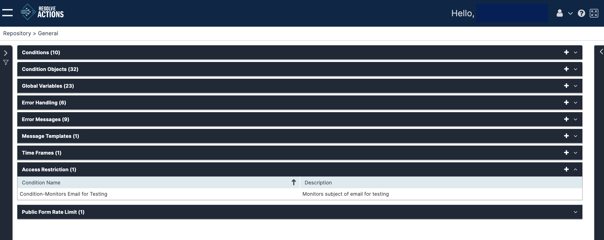

## Understanding Time Frames

Time frames are designated time slots used to define the timing validity of [conditions](./Conditions.mdx), [Schedules and Triggers](../Schedules-and-Triggers/Understanding-Schedules-and-Triggers.mdx), and to condition by time-slots, the activities of workflows.

Choose **Repository > General** and open the **Time Frames** list. The following window is displayed:

## Managing Time Frames

The time frame list provides the following information:

| Column | Description |
| --- | --- |
| Name | The name of the time frame object |
| Description | The description of the time frame object |
| Time Zone | The selected international Time zone |
| Validity | The period in which the time frame object is valid: The beginning and end time of the time frame |
| Active On | Active days of the week for the time frame object |

To add a time frame:

1. Click the plus icon.  
   The Time Frames properties window appears.
2. In the **Name** field, enter the time frame object's name.  
   For example: "Weekend".
3. In the **Description** field, enter a description for the time frame object.
4. Select the **Time Zone**.
5. In **Valid From** and **Valid Until**, set the date range in which the time frame will be valid.  
   You can select both dates from the Calendar widget.
6. In **Days**, select one or more days in which the time frame is valid.
7. Use the **Between** spin wheels to set its starting time and ending time.  
   You can also select each time field and type in the times in `hh:mm` 24-hour format.
8. Click **Save**.