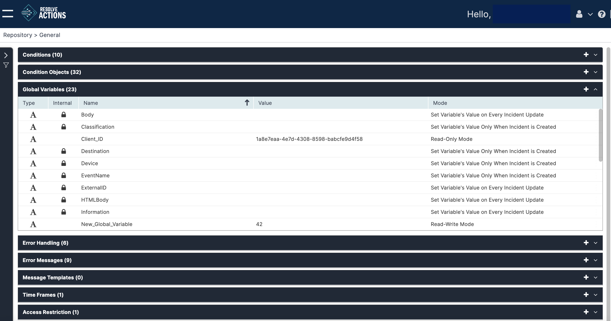
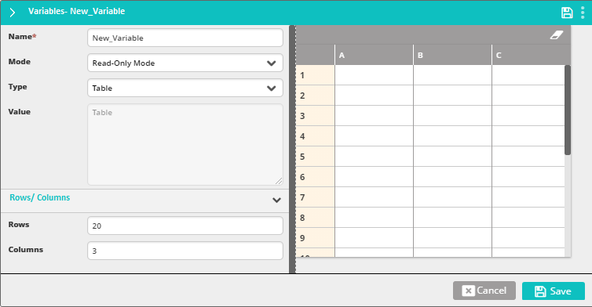

## Understanding Variables

Variables are system parameters used to represent a dynamic value.

Some variables, such as **Classification** or **Body**, which will hold, respectively, the [classification](../Incident-Configuration/Classifications.mdx) of the current incident or the text of the message that triggered an event, are built-in. You may customize your own list of variables to comply with your own system requirements and use the parsing mechanism to set the variable values as a new event is retrieved by Resolve Actions. The variables may then be used by workflow activities. Their values may be updated upon every new instance of an [incident](../Incident-Configuration/Introduction-to-Incident-Configuration.mdx), or only upon the first instance. The value may also be changed using the Memory Set activity by selecting the Global type variable.

<!--
???restore me
The value may also be changed using the [Memory Set](../../List-of-Activities/Controls/memory-set.mdx) activity by selecting the Global type variable.
-->

:::note
To learn more about events, incidents and parsing refer to [Understanding the VAR::PRODUCT_FULL Data Flow](../../../Getting-Started/Welcome/Understanding-the-Data-Flow.mdx).
:::

The following table sets out Resolve Actions built-in variables:

| Variable | Description | Update Method |
| --- | --- | --- |
| Body | The body of the triggering message | Every new instance |
| Classification | The classification (type) of the new Incident | The first instance |
| Destination | The recipient of the triggering message | The first instance |
| Device | The originating device of the incident | The first instance |
| EventName | The device or service of the incident | The first instance |
| ExternalID | The external application event ID | Every new instance |
| FirstInstance | Indicates whether or not it is the incident's first instance. | The first instance |
| HTMLBody | The HTML body of the triggering message | Every new instance |
| Information | The information of the triggering message | Every new instance |
| OS | Operating system of the device | Every new instance (this variable is set by default. If an invalid OS is reported then it will be set to **Windows 2003 Server**). |
| Process | The process of the new Incident | The first instance |
| ReturnValue | The returned Value of the last workflow activity | Every new instance |
| Service | The service of the new incident | The first instance |
| Severity | The severity of the new incident | The first instance |
| Site | The site of the new incident | Every new instance | 
| Solution | The solution of the new incident | Every new instance |
| Source | The source of the triggering message | Every new instance |
| State | The state of the triggering message | Every new instance |
| Subject | The subject of the triggering message | Every new instance |
| System | The system of the new incident | Every new instance |

Choose **Repository > General** and open the **Variables** list. The following window is displayed:

## Managing Variables

The variables list provides the following information:

| Column | Description |
| --- | --- |
| Type | Variable type: Text (), Table (), or Password ()|
| Name | Variable name |
| Variable value | String value or Table indicator |
| Mode | Update method |

To add a variable:

1. Click the plus icon.  
   The Variables properties window appears.
2. Enter the variable's **Name**.  
   For example: "Counter".
3. In the **Value** field, you can enter the variable's initial value.  
   This value will or will not change according to its usage.
4. From the **Mode** field choose one of:
   * **Set Variable's Value Only When Incident is Created**—The variable is set only once during the incident's lifecycle—to the data received with the event responsible for the incident's creation. Any updated values incoming with other events considered to be part of the same incident, are ignored.
   * **Set Variable's Value on Every Incident Update**—The variable updates its value every time a new event is received, where one of the pre-parsed properties has the same name.
   * **Read-Only Mode**—The variable is a constant that cannot be changed.
   * **Read-Write Mode**—The variable can be modified during a workflow run.
5. In **Type**, determine whether the format of the variable:
   * **Text**—Use for string-type data values.
   * **Table**—Typically used by workflow activities from the [Tables](../../../Activity-Repository/Tables/Tables-Overview.mdx) category.
   * **Password**—Use for sensitive string-type data like passwords. These variables' values are masked in the UI and logs and only provided in full to activities or triggers that reference the variable. Note that even though internally activities have access to the unencrypted value, they are prevented from printing or showing it.
6. If the variable holds a table, the table properties will appear:
   
7. Set the number of rows and columns and, optionally, the names of the columns.
8. Click **Save**.
