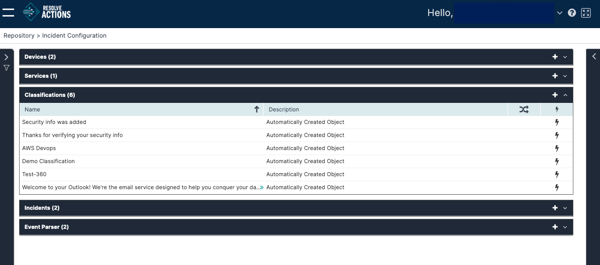

## Understanding Classifications

In events that are classified as incidents, classifications are used to indicate, during the parsing/mapping procedure, the type of the incident.

:::note
To learn more about the VAR::PRODUCT_FULL data flow, refer to [Understanding Resolve Actions Data Flow](../../../Getting-Started/Welcome/Understanding-the-Data-Flow.mdx). To learn more about incidents, refer to [Incidents](./Incidents.mdx).
:::

Choose **Repository > Incident Configuration** and open the **Classifications** list. The following window is displayed:

## Managing Classifications

The classifications table provides the following information:

| Column | Description |
|---|---|
| Name | Name of the classification |
| Description | Description of the classification |
|  | Execute workflow to execute the workflow upon each update of an incident related to this classification |
|  | Created automatically as a result of an incoming incident, or manually by the user |

### Adding Classifications

To add a classification:

1. Click the plus icon.  
   The classification properties window appears.
2. In the **Name** field, enter the name of the classification.  
   For example: "disk space incidents".
3. In the **Description** field, enter a description for the classification.
4. Check **Run Workflow for Every Update** to execute the workflow upon each update of an incident related to this classification, or leave it unchecked in case you wish to run the workflow only upon the first instance of the incident.
5. Click **Save**.