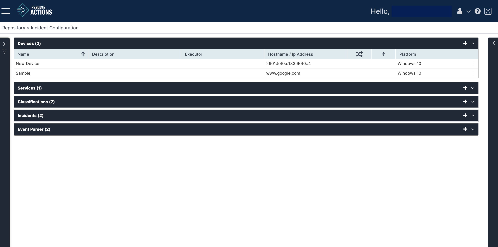

## Understanding Devices

In events that are classified as incidents, devices are used to indicate, during the parsing/mapping procedure, the specific server on which the incident occurred. An VAR::PRODUCT_FULL device is a server on which incidents may occur.

Devices may also be created manually and used in workflow activities. For example: you can create a device and then use it in a [Ping](../../../Activity-Repository/Network/ping.mdx) activity.

:::note
To learn more about the VAR::PRODUCT data flow, refer to [Understanding Resolve Actions Data Flow](../../../Getting-Started/Welcome/Understanding-the-Data-Flow.mdx). To learn more about incidents, refer to [Incidents](../Incident-Configuration/Incidents.mdx).
:::

Choose **Repository > Incident Configuration** and open the **Devices** list. The following window is displayed:

## Managing Devices

The Devices list provides the following information:

| Column | Description |
|---|---|
| Name | Name of the service |
| Description | Description of the service |
| Executor | The Executor through which activities associated with this device will run. If no Executor is defined, the default Executor (first in the list) will be used. |
| IP Address | Device's IP address |
|  | Every time an incident that is associated with this device or service is updated, run a check to see if any triggers match that event and have any associated workflows that must be run to act on the incident. |
|  | Created automatically as a result of an incoming incident, or manually by the user |
| Platform | Device's platform e.g. Windows Server 2003 |
 
### Adding Devices

To add a device:

1. Click the plus icon.  
    The device properties window appears.
2. In the **Name** field, enter the actual name of the device.
3. In the **Description** field, enter a description for the device.  
   For example: "mail server".
4. From the **Executor** field, select the Executor of the workflow to which the device belongs.    
5. In the **IP Address** field, enter the IP address of the device.
6. From the **Platform** field, select the server's platform.  
   :::note
   Specifying the device's platform allows Actions to determine the command type to execute (Windows based or UNIX based) when operating any workflow activity on the device.
   :::
7. Check **Execute Workflow for Every Update** to execute the workflow upon each update of an incident related to this device, or leave it unchecked in case you want to run the workflow only upon the first instance of the incident.
8. Under **Authentication**, do the following:
   1. In **User Name** and **Password**, enter the credentials of the user who will be accessing the device.  
   Alternatively, next to the **SSH Certificate** field, click **Browse** and select an SSH certificate.  
   To remove the selected certificate, click **Reset**.  
   :::note
   The credentials/SSH certificate will be used by workflow activities to access the device.
   :::
   2. Check **Do not Inherit SSH Certificate** if you don't want to inherit the SSH details.
   3. Leave the **SNMP MIBs** field blank.
   :::note
   VAR::PRODUCT does not support SNMP events.
   :::
   4. In **Mac Address**, enter the device's MAC address.  
   It can be used, for example, to turn on the device via Wake on LAN workflow activity if it has been shut down for any reason.
9. Click **Save**.