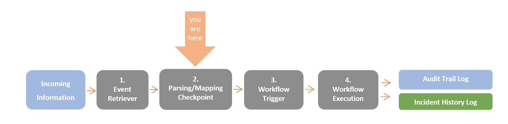
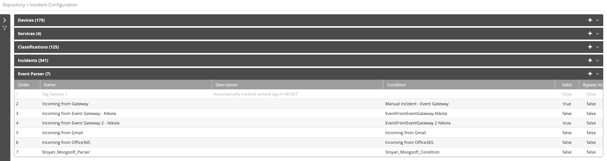

## Understanding Event Parsing

When an event is retrieved by VAR::PRODUCT_FULL, it arrives at the Parsing/Mapping Checkpoint, where it is decided whether it qualifies as an incident. Traditionally, events which originate from an integrated module (for example: ServiceNow, McAfee, BMC Remedy etc.) are mapped, and events which originate from the built-in components are parsed. The event parser object allows you to create code (C# or VB.NET) according to which events are parsed.

:::note
To learn more about Resolve Actions data flow, refer to [Understanding Resolve Actions Data Flow](../../../Getting-Started/Welcome/Understanding-the-Data-Flow.mdx). To learn more about incidents, refer to [Incidents](./Incidents.mdx).
:::

Choose **Repository > Incident Configuration** and open the **Event Parser** list. The following window is displayed:

## Managing Event Parsers

The event parser list provides the following information:

| Column          | Description                                                                                                                                                                                                                                           |
|-----------------|-------------------------------------------------------------------------------------------------------------------------------------------------------------------------------------------------------------------------------------------------------|
| Order           | The order in which the parser is applied. Parsers may be moved up or down in the parser list.                                                                                                                                                         |
| Name            | Name of the event parser                                                                                                                                                                                                                              |
| Description     | Description of the event parser                                                                                                                                                                                                                       |
| Condition       | Condition (if any) set in the parser                                                                                                                                                                                                                  |
| Valid           | Indicates whether the event parser is valid. In this case, valid means that during the creation of the event parser you clicked on Test Parsing and got the desired result with no errors. If a parser isn’t valid, it will be ignored by the system. |
| Bypass Incident | Bypass incident creation when an event arrives that matches this parser. Use this when you don’t want to create an incident that matches the event, but you do want to create variables from the event that can be used in workflows.                 |

## Operations on Event Parsers

For a selected event parser, the following action icons are available:

| Icon | Description |
|---|---|
|  | Move one place up in the parser list |
|  | Move one place down in the parser list |
|  | Disable the parser |
|  | Enable the parser |
|  | Delete the parser |
|  | Add a new parser |

:::note
Unavailable icons are grayed out.
:::

In addition, the Actions (three-dot) menu is available. Is allows you to perform some of the same actions.

### Adding Event Parsers

To add an event parser:

1. From the top right corner of the parser list, click the plus icon.  
   The parser properties screen appears.
2. In the **Name** field, enter the name of the event parser.
3. In the **Description** field, enter a description for the event parser.
4. In the **Condition** field, select a [condition](../General/Conditions.mdx).  
   You must choose a condition. Selecting **Any** effectively says "use the parser unconditionally". The items following **Any** are user defined. To add a new condition, click the plus icon. For further details about adding conditions, see [Managing Conditions](../General/Conditions.mdx#managing-conditions).
5. Check **Bypass Incident** to parse incoming events into global variables.
6. Under **Code**, select the coding language and compose your parsing code.
7. Under **Test Parsing** you may illustrate an incoming event and test your code.
8. Click **Save**.