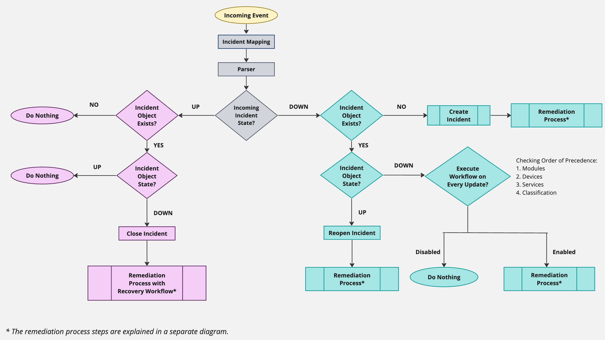
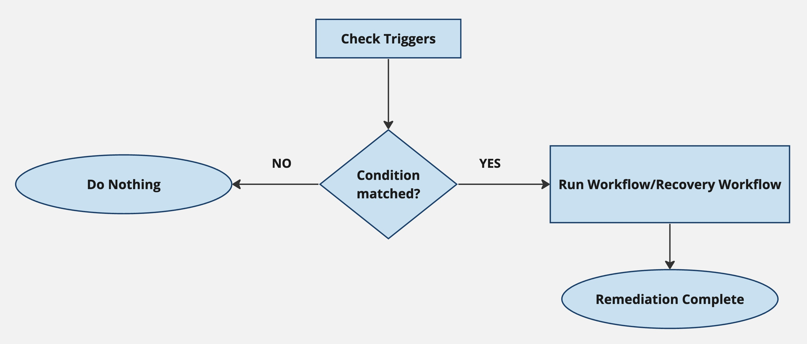
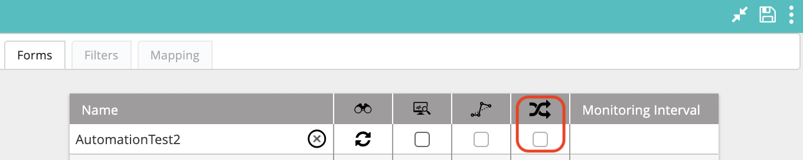

Incident caching is an event deduplication mechanism that enables you to control the way VAR::PRODUCT_FULL responds to repeating incoming events generated by external systems.

In response to an event from an external system, the typical steps in VAR::PRODUCT are to create an incident and initiate a workflow. In many cases however, the external system will continue to send the same or similar events until the incident is resolved.

Incident caching is a way to suppress the generation of repeating incidents from those events in VAR::PRODUCT, aggregating them under the same incident instead. It is highly recommended to enable incident caching to prevent infinite loops or overloading your system.

Take a Jira issue as an example. With the creation of a new Jira issue, an VAR::PRODUCT incident is created. Before the issue is closed, a multitude of changes to this issue might occur—editing the description or uploading an attachment, for example. When incident caching is enabled, it will ensure that these updates are all associated with the same incident so that no workflow for the creation of a new incident is triggered.

## Understanding Incident Caching

The logic behind incident caching is based on the incident state, which can be, in VAR::PRODUCT terms, Up or Down:

* State Up means that the incident has been closed.
* State Down means that the incident is open.

:::note
As the systems that you integrate with VAR::PRODUCT can vary, the Up and Down states available in VAR::PRODUCT can correspond to different states or statuses on the integration system. Moreover, a single VAR::PRODUCT state can correspond to multiple integration states. Use the mapping settings of some of the [integration modules](../../Configuration/Integrations-and-Modules/understanding-integrations-and-modules.mdx) to define how these map with each other, for example the [mappings of the Jira integration module](../../Configuration/Integrations-and-Modules/Integration-Modules/jira-module.mdx)
:::

The incident process is initiated by an incoming event into VAR::PRODUCT. After the event goes through incident mapping and, optionally, parsing, a logic kicks in to determine whether the event's State field is set to Up or Down. 

The following diagram is an overview of the incident caching mechanism. Each of the logic's branches is explained in greater detail in the next sections.

The trigger evaluation at the end of each logic branch is followed by a predefined remediation process whose logic looks like this:

If the trigger conditions are matched, a specified workflow or recovery workflow is run and the remediation process is complete. If they aren't matched, no further action is taken.

### Incident State Is Up

After determining that the incoming event's State is Up, we check whether an incident object already exists for this incident. If it doesn't, we don't need to create a new incident object for a closed (Up) incident, hence we take no further action. If the incident does exist, its state is next evaluated.

:::note How do we know it's the same or a different incident?
The incident (also referred to as incident object) is a combination of these variables:

* Eventname (Device name or Service name)
* Classification

If the pair matches an existing incident, VAR::PRODUCT counts the event towards that incident.
:::

If the incoming event is mapped to an existing incident in the Up state, no action is taken and the event is recorded in the [Incident History](../../Insight/Incidents-History/viewing-the-incident-history.mdx) and **not** in the [Audit Trail](../../Insight/Audit-Trail/viewing-the-audit-trail-log.mdx). If the existing incident's state is Down, VAR::PRODUCT will close the incident and end its life cycle. After that, VAR::PRODUCT will evaluate all triggers and run any Recovery workflows that they specify.

### Incident State Is Down

If the incoming event's State field is Down, the first check is again whether the incident exists. If it doesn't, VAR::PRODUCT will create one and the triggers will be checked to determine the workflow to be executed.

:::note How do we know it's the same or a different incident?
The incident (also referred to as incident object) is a combination of these variables:

* Eventname (Device name or Service name)
* Classification

If the pair matches an existing incident, VAR::PRODUCT counts the event towards that incident.
:::

If the incident does exist, VAR::PRODUCT will then check its current state. If it is Up, VAR::PRODUCT will reopen the incident and then evaluate triggers to run the specified workflow. If the current state is Down, the **Execute Workflow on Every Update** option is evaluated to determine if this event should be suppressed as a duplicate or if VAR::PRODUCT should continue with the remediation process. Since the option can be set on multiple levels, VAR::PRODUCT checks for its state in this order:

* Module form level (in case the incoming event is pulled from a module)
* Device level
* Service level
* Classification level

If the property is enabled, VAR::PRODUCT continues and evaluates triggers to run an appropriate workflow. Otherwise, the event will be suppressed and no further action will be taken. When events are suppressed (or deduped), the incoming event details are not published in the [Audit Trail](../../Insight/Audit-Trail/viewing-the-audit-trail-log.mdx) log and will only be visible in the [Incident History](../../Insight/Incidents-History/viewing-the-incident-history.mdx) view.

## Configuring Incident Caching

Incident caching can be configured in several places in the VAR::PRODUCT user interface:

* In **Configuration > Modules**, click on the module you want to configure. Open the module configuration panel on the right and click the **Extend** arrows to the top right. In the **Forms** tab, ensure that the **Execute Workflow on Every Update** box for the respective form is **unchecked**.
    
* In **Repository > Incident Configuration > Devices**, click on the device you want to configure. Open the device configuration panel on the right and ensure that the **Execute Workflow for Every Update** box is unchecked.
* In **Repository > Incident Configuration > Services**, click on the service you want to configure. Open the service configuration panel on the right and ensure that the **Execute Workflow for Every Update** box is unchecked.
* In **Repository > Incident Configuration > Classifications**, click on the classification you want to configure. Open the classification configuration panel on the right and ensure that the **Execute Workflow for Every Update** box is unchecked.
* In **Repository > Incident Configuration > Incidents** (this is the incident object), click on the incident you want to configure. Open the incident configuration panel on the right and ensure that the **Execute Workflow for Every Update** box is unchecked.

If the box is checked in any of these configurations, the incident update will check for matching workflows in the triggers on every update.

## Effect of Incident Caching on Mapped Global Variables

Global variables are one of the ways to get data from an integration. You can map a global variable to a data field from the integration and then build your workflows around it.

Similarly to incident caching where you don't want a new incident to be created with every event coming from the integration, you might want to prevent a mapped global variable to update with every integration field update. To control how the variable updates, set its mode when creating or editing it:

* **Set Variable's Value Only When Incident is Created**—The variable is set only once during the incident's lifecycle—to the data received with the event responsible for the incident's creation. Any updated values incoming with other events considered to be part of the same incident, are ignored.
* **Set Variable's Value on Every Incident Update**—The variable updates its value every time a new event is received, where one of the pre-parsed properties has the same name.
* **Read-Only Mode**—The variable is a constant that cannot be changed.
* **Read-Write Mode**—The variable can be modified during a workflow run.
