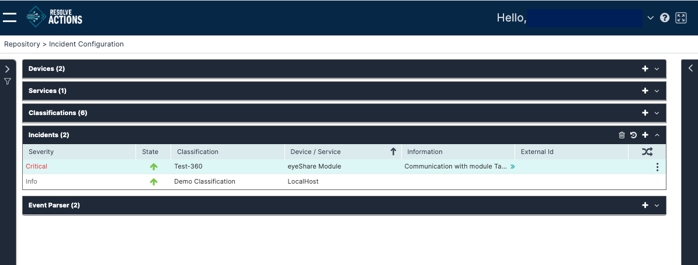

## Understanding Incidents

Choose **Repository > Incident Configuration** and open the **Incidents** list. The following window is displayed:

## Managing Incidents

The Incidents list provides the following information:

import Admonition from '@theme/Admonition';

| Column | Description                                                                                                                                                                                                                                                                                                                                                                                                                                                                                                                                                                                                                                                                                                                                                                                                  |
| --- |--------------------------------------------------------------------------------------------------------------------------------------------------------------------------------------------------------------------------------------------------------------------------------------------------------------------------------------------------------------------------------------------------------------------------------------------------------------------------------------------------------------------------------------------------------------------------------------------------------------------------------------------------------------------------------------------------------------------------------------------------------------------------------------------------------------|
| Severity | Indicates the incident's severity: Critical, Info, or Warning.                                                                                                                                                                                                                                                                                                                                                                                                                                                                                                                                                                                                                                                                                                                                               |
| State |  - Up,  - Down.                                                                                                                                                                                                                                                                                                                                                                                                                                                                                                                                                                                                                                                                                                          |
| Classification | The classification of the incident.                                                                                                                                                                                                                                                                                                                                                                                                                                                                                                                                                                                                                                                                                                                                                                          |
| Device/Service | The device/service which gave rise to the incident.                                                                                                                                                                                                                                                                                                                                                                                                                                                                                                                                                                                                                                                                                                                                                          |
| Information | Additional information.                                                                                                                                                                                                                                                                                                                                                                                                                                                                                                                                                                                                                                                                                                                                                                                      |
| External ID | 
An external ID of the incident.

For incidents that are parsed using the [Event Parsing](./Event-Parsers.mdx#managing-event-parsers) mechanism or created using the [New Incident](../../../Activity-Repository/Incidents/Actions/new-incident.mdx) activity, the external ID is created automatically. For incidents that were created by mapping (using one of the built-in integrations), the external ID is the value mapped by VAR::PRODUCT into the module configuration. It is an internal procedure that allows applying a distinctive ID to every incident.

Example: If the integration is a ticketing system, the external ID can be mapped to the ticket ID. By doing so, every time a new ticket is created, a new incident will be created too, regardless of the Device/Service and Classification combination.
 |
|  | Execute workflow for every update.                                                                                                                                                                                                                                                                                                                                                                                                                                                                                                                                                                                                                                                                                                                                                                           |

## Operations on Incidents

For a selected incident, the following action icons are available:

| Icon | Description |
| --- | --- |
|  | Delete the incident. |
|  | Open the incident history. |
|  | Add a new incident. |

In addition, clicking the Actions (three-dot) menu opens the actions list where you can run some of the same actions.

### Adding Incidents

To add an Incident:

1. From the top right corner of the incident list, click the plus icon.  
   The incidents properties screen appears.
2. From the **Device/Service** field, determine whether the incident is related to a [device](./Devices.mdx) or a [service](./Services.mdx).
3. In the **Name** field, enter the name of the device or the service.  
   For example: `Web_SRV` or `Mail Service`, respectively.
4. In the **Description** field, enter a description for the incident.
5. From the **Classification** field, select the classification to which the incident belongs.
6. Check **Run Workflow for Every Update** to execute the workflow upon each update of the incident, or leave it unchecked if you wish to run the workflow only upon the first instance of the incident.
7. Click **Save**.