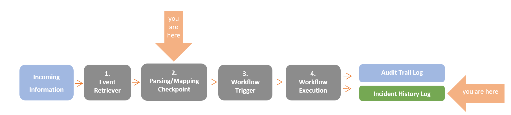
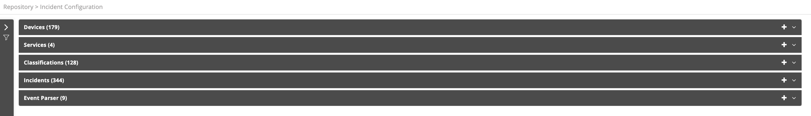

At the end of the parsing/mapping process some **events** are classified as **incidents**. Events in VAR::PRODUCT_FULL are defined by a device/service and a classification. A wide range of activities may be performed on an incident:

* Incidents provide Resolve Actions with their originating device, their duration, their classification. Incidents also have a current state - up/down. This information may be analyzed and used in reports, in conditions and within running workflows. Workflows may also be invoked upon state change.
* Incidents are counted and registered to the Incident History Log.

Choosing **Repository > Incident Configuration** from the Navigation menu opens the following window:

