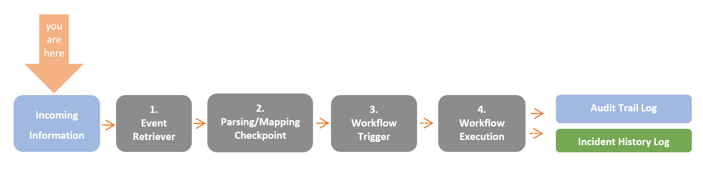
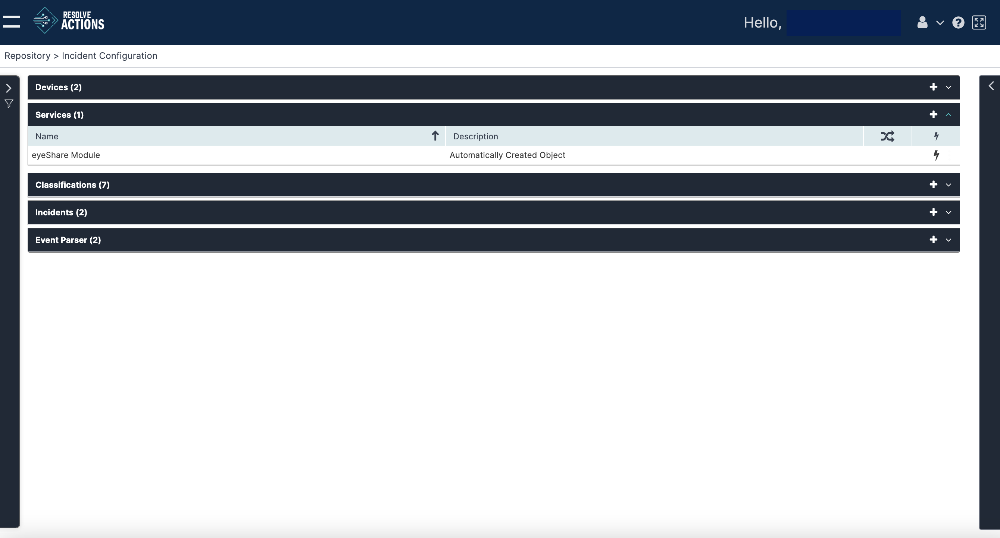

## Understanding Services

In events that are classified as incidents, services are used to indicate, during the parsing/mapping procedure, the specific function on which the incident occurred. An VAR::PRODUCT_FULL service in is component in which incidents may occur.

:::note
To learn more about the VAR::PRODUCT data flow, refer to [Understanding Resolve Actions' Data Flow](../../../Getting-Started/Welcome/Understanding-the-Data-Flow.mdx). To learn more about incidents, refer to [Incidents](../Incident-Configuration/Incidents.mdx).
:::

Choose **Repository > Incident Configuration** and open the **Services** list. The following window is displayed:

## Managing Services

The Services list provides the following information:

| Column | Description |
| --- | --- |
| Name | Name of the service |
| Description | Description of the service |
|  | Every time an incident that is associated with this device or service is updated, run a check to see if any triggers match that event and have any associated workflows that must be run to act on the incident |
|  | Created automatically as a result of an incoming incident, or manually by the user |

### Adding Services

To add a service:

1. Click the plus icon.  
    The service properties window appears:  
2. In the **Name** field, enter the name of the service.  
   For example: mail service.
3. In the **Description** field, enter a description for the service. 
4. Check **Run Workflow for Every Update** to execute the workflow upon each update of an incident related to this service, or leave it unchecked in case you wish to run the workflow only upon the first instance of the incident.
5. Click **Save**.