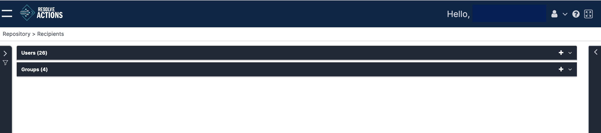

Recipients are receivers of messages and notifications. They can be grouped into recipient groups. Recipients are not login users, as defined in [User Management](../../../Product-Navigation/Configuration/User-Management/introduction-to-user-management.mdx).

Choosing **Repository > Recipients** from the Navigation menu opens the following window:

