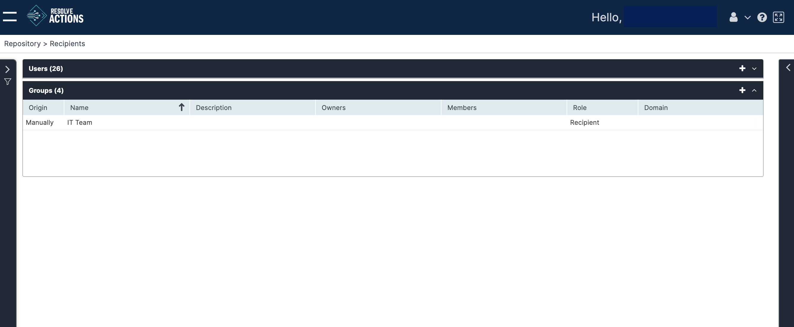

Choose **Repository > Recipients** and open the **Groups** list. The following window is displayed:

The Group list provides the following information:

| Column | Description                                                                    |
| --- |--------------------------------------------------------------------------------|
| Origin | Imported manually or from Active Directory                                     |
| Name | Name of the group                                                              |
| Description | Group description                                                              |
| Owners | A group may have several owners shown in a comma separated list                |
| Members | Group members                                                                  |
| Role        | [Role](../../../Product-Navigation/Configuration/User-Management/introduction-to-user-management.mdx) assigned to the group (meaning to all of its users) |
| Domain      | Active Directory domain (if applicable)                                        |

## Adding Groups

To add a new group:

1. From the top right corner of the incident list, click the plus icon.  
   The users properties screen appears.
2. Enter the group name and description.
3.  Set the group owner/s.  
   :::note
   Group owners are the only users other than the administrators who are allowed to edit or delete the group.
   :::
4. Set the group members.  
   :::note
   A group member may be a user or another group.
   :::
   1. Under **Type**, select **User** to add a user to the group or **Group** to add a sub-group to the group.
   2. Under **Name**, select the user or group to be added.
   * Use the plus icon to add a new user or group.
   * For further details about adding a new user, see [Managing Users](./Managing-Users.mdx).
   * The imported/manual field will be set from the user or group selected.
5. To remove any member - user or group - from the group, select it from the list and click the X button.
6. Click **Save**.
