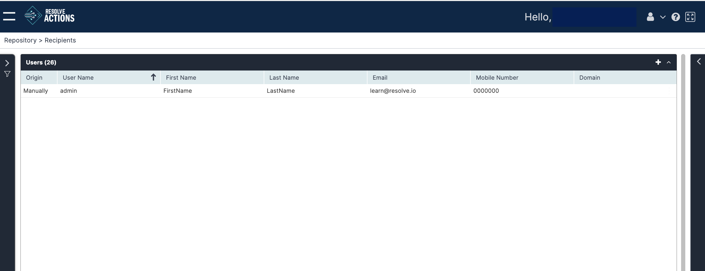

Choose **Repository > Recipients** and open the **Users** list. The following window is displayed:

The Users list provides the following information:

| Column              | Description                                           |
|---------------------|-------------------------------------------------------|
| Origin              | Imported manually or from Active Directory            |
| User Name           | User display name                                     |
| First Name          | User first name                                       |
| Last Name           | User last name                                        |
| Email               | User email (not validated here)                       |
| Mobile Phone Number | User mobile phone number                              |
| Domain              | The Active Directory domain (if applicable)           | 

## Creating Users

To manually create a user:

1. From the top right corner of the incident list, click the plus icon.  
   The users properties screen appears.
2. Enter the user's name, email address, mobile phone number, and employee ID.  
   :::note
   The user email address and mobile phone number will be used when VAR::PRODUCT_FULL contacts the recipient.
   :::
3. Optionally, under **Group Membership**, add the user to one or more groups.  
   :::note
   You can also add the user to a group by [editing the group](./Managing-Groups.mdx).
   :::
   1. Under **Name**, select the group to which the user will be added.
      * Use the plus icon to add a new group.
      * For further details about adding a new group, see [Managing Groups](./Managing-Groups.mdx).
      * The imported/manual field is set to manual if the group was created inside Resolve Actions or imported otherwise.
   2. To remove the user from the group, select the group from the group membership list and click the X button.