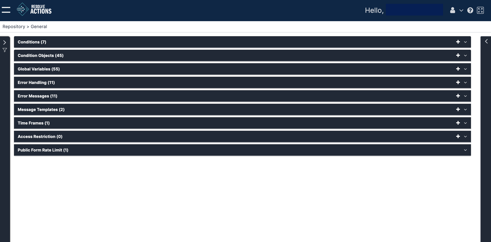
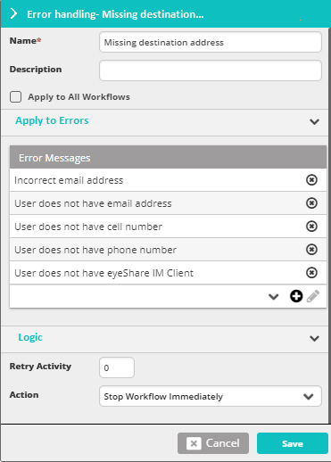

The following example from **Repository > General**, is a typical entity panel:

The entity panel (open) displays the available objects in each sub-category window.

To display the available entities:

1. From the upper right corner of any entity panel, click the expand arrow.  
   A list of available entities opens.
2. Click any column to sort the list by it.
3. Drag and drop the column headers to rearrange the table.
4. Click the plus icon to create a new object or the trash can icon to remove one.  
   Alternatively, click the three-dot menu and then click Delete.  
   Multiple selection is also available.

To display the properties of an entity:

1. Select the entity by clicking its row.
2. Expand the panel that appears to the right of the list.  
   The properties of the entity will then appear on the right side of the screen:
    
3.  Perform any change to the entity and click **Save**.
    :::note
    The plus icon  icon often appears in choice fields. It is a convenience feature enabling you to create a new entity of the type in the selection list. We will not refer to it further, since using it just links you to another function in the system without requiring you to leave what you are doing.
    :::