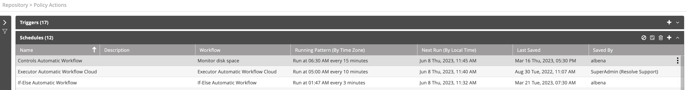

## Managing Scheduled Workflows

Choose **Repository > Schedules and Triggers** and open the **Schedules** list. The following window is displayed:

The schedules list provides the following information:

| Column                         | Description |
|--------------------------------| --- |
| Name                           | Name of the schedule |
| Description                    | Description of the schedule |
| Workflow                       | The workflow to run |
| Running Pattern (By Time Zone) | Running or recurrence pattern of the scheduled workflow |
| Next Run (By Local Time)       | Time of the next run due |
| Last Saved                     | Last save (modification) time |
| Saved By                       | User responsible for the last save (modification) |

## Operations on Schedules

For a selected schedule, the following action icons are available:

| Icon | Description |
| --- | --- |
|  | Disable the schedule |
|  | Enable the schedule |
|  | Delete the schedule |
|  | Add a new schedule |

:::note
Unavailable icons are grayed out.
:::

The Actions (three-dot) menu on a trigger allows you to do the same actions.

### Adding Schedules

To add a schedule:

1. From the top right corner of the schedules list, click the plus icon.  
   The schedules properties screen appears.
2. In the **Name** field, enter the name of the schedule.  
   For example: "Daily Backup".
3. In the **Description** field, enter a description for the scheduled workflow. 
4. Clear **Enabled** to disable the schedule.
5. From the **Workflow** field, select the workflow to be run.
6. In the **Variables** section, add the *Name* and *Value* for each variable you wish to add to your scheduled workflow.
      * Variables must have a defined value.
      * The Variable Value must be copied from the selected Workflow. 
7. Clear **Log** if you do not wish to display each running of the selected workflow in the Audit Trail log, otherwise specify the **Log Folder**.
8. In the **Recurrence Pattern** field, determine whether the workflow is repeated hourly, daily, weekly, monthly, or is simply performed once.
9.  According to your selection in the previous step, select the workflow's running time frame and the frequency.
10. Check **Stop Workflow...** to specify the timeout of the scheduled workflow and set it.

:::note
The **Stop Worfklow** time duration must be entered in minutes.
:::

11. Check **Skip Execution...** to avoid re-running the workflow if the previous scheduled workflow has not yet ended.
12. In **Valid From** and **Valid Until**, set the validity date frame of the scheduled workflow.  
   :::note Showing Time Zones When Adding a Schedule
   **Time zone** is displayed when creating a new schedule for both the run time and the validity.
    
   The time zone is taken from your tenant settings. Contact Resolve Support if you need to change it. The default time zone is Eastern Time Zone (ET).
    
   The same **Time Zone** is also shown in the **Schedules** table in both the **Running Pattern** and the **Next Run** columns.
   :::
13. Click **Save**.