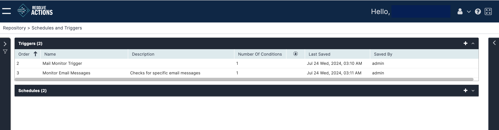

## Managing Triggered Workflows

Choose **Repository > Schedules and Triggers** and open the **Triggers** list. The following window is displayed:

The triggers list provides the following information:

import Admonition from '@theme/Admonition';

| Column | Description |
| --- | --- |
| Order | The order in which the trigger is applied. Triggers may be moved up or down in the triggers list. <Admonition type="note">
Triggers are checked and performed according to the order in which they are listed. As some events may match the criteria of several triggers, it is important to situate triggers in the requested operation order.
</Admonition> |
| Name | Name of the trigger |
| Description | Description of the trigger |
| Number of Conditions | The number of conditions in the trigger's condition table (at least one must apply to execute the selected workflow). |
|  | Terminating action -  or not - Blank |
| Last Saved | Last save (modification) time |
| Saved By | User responsible for the last save (modification) |

:::tip
In the triggers list, you may delete a trigger, enable/disable it and move it up/down (triggers are checked in their listing order).
:::

## Operations on Triggers

For a selected trigger, the following action icons are available:

| Icon | Description |
| --- | --- |
|  | Move one place up in the triggers list |
|  | Move one place down in the triggers list |
|  | Disable the trigger |
|  | Enable the trigger |
|  | Delete the trigger |
|  | Add a new trigger |

:::note
Unavailable icons are grayed out.
:::

The Actions (three-dot) menu on a trigger allows you to do the same actions.

### Adding Triggers

To add a trigger:

1. From the top right corner of the trigger list, click the plus icon.  
   The trigger properties screen appears.
2. In the **Name** field, enter the name of the trigger.  
   For example: "Web Portal Recovery".
3. In the **Description** field, enter a description for the trigger.
4. Clear **Enable** to currently disable the trigger.
5. Clear **Audit Log** do avoid the triggered workflow to register to the [Audit Trail](../../Insight/Audit-Trail/viewing-the-audit-trail-log.mdx).
6. Check **Terminating Action** if you wish to terminate the trigger list check when the current trigger is activated.
7. Next to **Timing Constraints**, select the [Time Frame](../General/Time-Frames.mdx), in which the trigger is active, or select **Always**.
8. Under **Conditions**:
   1. Under **Condition**, select a [condition](../General/Conditions.mdx) checked from the drop-down list or select **Any** if you wish to initiate the workflow upon any incoming event.  
      :::note
      To catch any incoming events that were dropped by the listed triggers, it is recommended to use the **Any** option in the last trigger. The workflow activated by this trigger can notify the administrator of any unhandled event.
      :::
   2. Under **Workflow**, select the [workflow](../../../Building-Your-Workflow/introduction.mdx) that will be activated when the condition applies.
   3. Under **Recovery Workflow**, select the workflow to run after recovery from the incident.
   4. Under **Time Frame**, select the time frame in which the condition applies.
   5. Under **Log Folder** select the [log folder](../../Insight/Audit-Trail/viewing-the-audit-trail-log.mdx#displaying-the-event-log) to which this workflow run will be registered.
   6. Repeat the steps for each additional workflow you wish to add to the trigger.
9. Click **Save**.